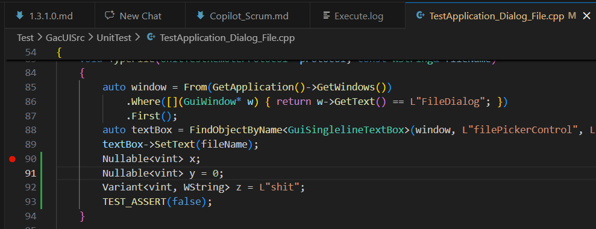
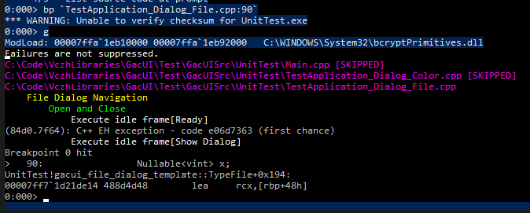
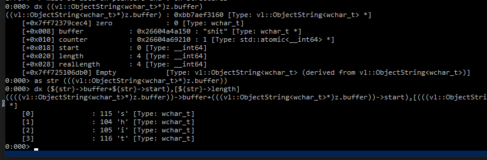
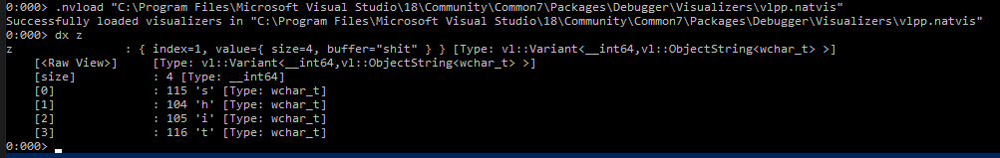
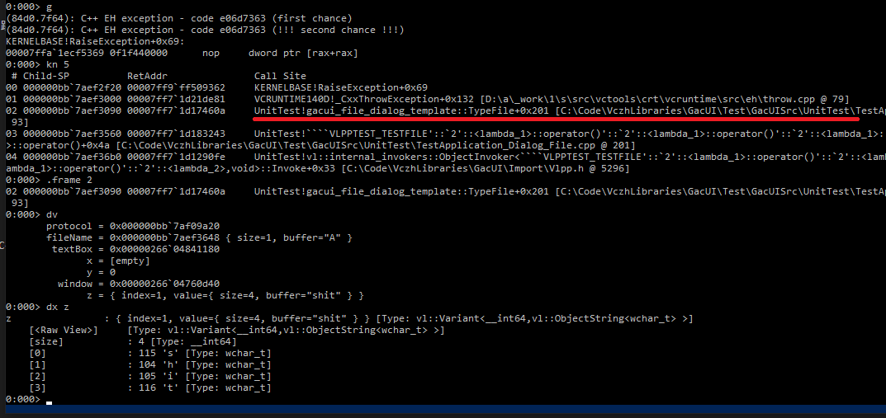

# 微软命令行调试器CDB光速入门（LLM适用版）

这里假设读者都是用Visual Studio和msbuild的用户，为了安装这个调试器，你需要打开VS的安装程序，切换到`Individual Components`，勾上`Windows Driver Kit`，然后把他装上去。
接着就是到[Download the Windows Driver Kit (WDK)]([Download the Windows Driver Kit (WDK)](https://learn.microsoft.com/en-us/windows-hardware/drivers/download-the-wdk))把WDK再装一遍。
VS自带的只是WDK的库，第二个就是WDK的所有UI工具了。
装完后就可以在`C:\Program Files (x86)\Windows Kits\10\Debuggers\x64\cdb.exe`找到，命令行就可以用起来了。

## 启动CDB

我们用CDB还是想要传统的按代码行的方式来调试。默认情况下VS会帮你把exe和pdb都生成在一起，那你什么都不需要做就可以加载符号。一般来说我们可以：
```
cdb -c ".lines; l+t; l+s" -o 你的exe 你的参数
```
启动CDB。这个时候程序时处于暂停状态的，你可以趁这个机会打断点，然后按`g`运行。如果你想直接运行，可以在-c的命令最后加上`; g`。

## 下断点

- `lm`：列出所有加载的模块。如果你的程序很简单就只有一个`UnitTest.exe`，那你就不用列了，模块名就是`UnitTest`。
- `bl`：列出所有断点
- `be 数字`：enable断点
- `bd 数字`：disable断点
- `bc 数字`：删掉断点

下断点用的是`bp`命令，他需要你给出指令的地址。但是我们想直接按照行号来也可以：
```
bp `file.cpp:line`
bp `UnitTest!file.cpp:line`
```

## 单步执行

有了断点之后就可以`g`（也就是VS的F5）然后停下来，这个时候：
- `p`：运行到下一行，也就是VS的F10
- `t`：进函数里面，也就是VS的F11
- `pt`：退出函数

## 查看堆栈

不管是程序炸了还是命中断点，这个时候就要开始看变凉了。你可以用`kn`查看完整的callstack，如果太长的话你也可以用`kn 10`只显示10行。callstack的左边是从0开始排列的数字，看看你想进哪个函数里面看，然后`.frame 数字`。

## 查看变量

CDB牛逼的地方是他可以和VS用相同的[.natvis](https://github.com/vczh-libraries/Vlpp/blob/master/Release/vlpp.natvis)文件。你可以`.nvload`它。

首先用`dv`列出当前函数的所有变量，接着就可以用`dx`去看。调试一个C++程序的话，`dx`甚至可以用C语言的语法来看一个表达式的值。如果是.net程序或者用`dx`查看内置的变量，你甚至可以用C#的linq来进行快速筛选。

## 退出

最后用`q`就可以退出了，顺便把被调试的程序杀了。

## 实战演示

在这里我简单的演示一遍。首先我们要启动`UnitTest.exe`然后在这里下断点：



```
& cdb -c ".lines; l+t; l+s" -o "UnitTest.exe"
```

进去之后依次输入
```
bp `TestApplication_Dialog_File.cpp:90`
g
```

我们就可以看程序开始跑，跑到我们的断点就会停下来：



我们跳3行到`TEST_ASSERT`，这个时候他还不会运行，所以还没炸。然后看看现在的堆栈，跳进去，打印z

```
p
p
p
kn 5
.frame 0
dv
dx z
```


这个时候我们可以看到`dx z`显示的是`Variant<vint, WString>`的裸成员。我们都知道C++的`Variant`实现是比较扭曲的，如果要我们在`dx`里面自己做casting也是麻烦的一笔。当然我们还是可以做：

```
dx ((vl::ObjectString<wchar_t>*)z.buffer)
as str (((vl::ObjectString<wchar_t>*)z.buffer))
dx (${str}->buffer+${str}->start),[${str}->length]
```



在这里`as`和`${str}`就是宏了，用的时候记得加上括号，道理和C语言的宏一样。

这个时候就是[.natvis](https://github.com/vczh-libraries/Vlpp/blob/master/Release/vlpp.natvis)发挥作用的时候了。我们直接`.nvload vlpp.natvix`然后再`dx z`一下：



爽！

到了结束的时候了，我们`g`让他把`TEST_ASSERT`执行，然后就炸了。炸完我们还是可以看变量，看完就走：

```
g
kn 5
.frame 2
dv
dx z
```



最后一个`q`优雅退出。

## 让LLM也能用CDB

VSCode里面跑copilot还要让LLM在命令行里面交互那是不可能的，所以我们只能把CDB包装成一个一个的命令，执行完退出看结果。所幸CDB是支持远程调试功能的，那么我们可以把server起起来。需要注意的是CDB server一样会等待我们的输入，所以不能占用当前的窗口。单机调试不用管任何安全或者是防火墙问题，简单直接：
```
cdb -server npipe:pipe=随便给个名字 ...
```

如果你只是想简单的连接他然后正常使用：
```
cdb -remote npipe:pipe=上面那个名字
```

不过让LLM来就得让`cdb -remote`跑完一个命令直接闪退。我们要做的事情就比较扭曲。比如说我们要跑`kn 5`命令。首先要创建一个文件，比如说input.txt

```
".cls`r`nkn 5`r`n.remote_exit" | Out-File -Encoding ASCII -FilePath input.txt
```

这个时候会得到：
```
.cls
kn 5
.remote_exit
```

然后一口气连接执行跑路：
```
cdb -remote npipe:pipe=上面那个名字 -cf input.txt | Tee-Object -FilePath output.txt
```

于是你就可以打开input.txt，找到最后的一行`xxx> .cls`，前面的全部删掉，就得到这个命令的运行结果了。这样做的原因是`cdb -remote`每次都会把所有的历史记录全部扒下来，用这个方法可以打个标记，就知道我们现在给的命令是从哪里开始输出的。

这一节的内容可以封装成脚本，这样就可以让LLM调试你的程序的同时不会被调试器打断命令行窗口了。

## 更新

我发现cdb还有`-clines 0`可以用，不用做这个`.cls`了。

Powershell 5.0有个问题，就是`echo ".remote_exit" | cdb ...`会带BOM，这就是为什么需要有个`input.txt`来装`.remote_exit`命令用于退出客户端。如果是更高版本的Powershell或者是CMD就没有这个问题。