# Mermaid Flowcharts

## JSON_ENFA.png

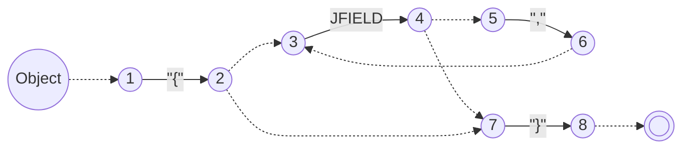

## JSON_PDA.png

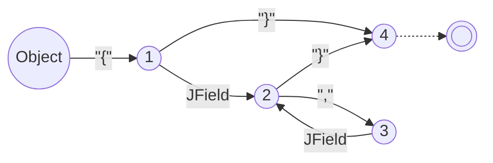

## JSON_PDA2.png

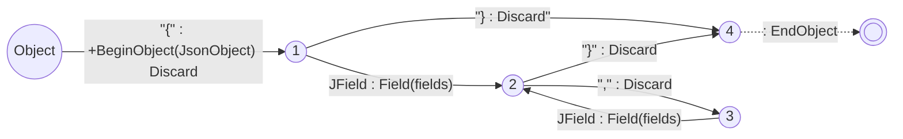

## JSON_PDA3.png

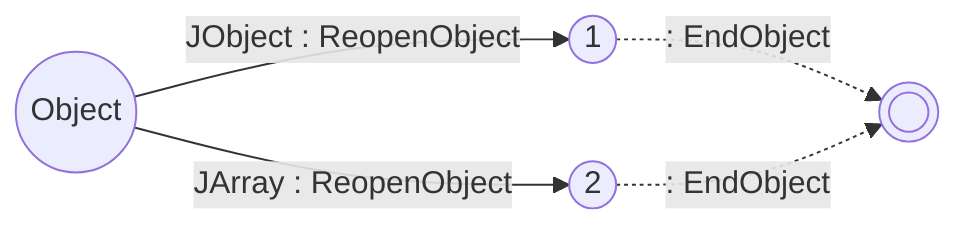

## Lrec_TermR.png

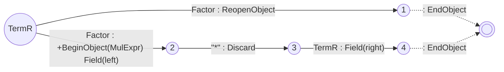

## Lrec_TermL.png

## Lrec_TermL2.png

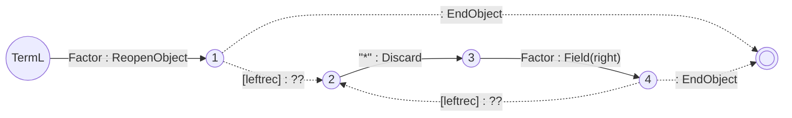

## Lrec_TermL3.png

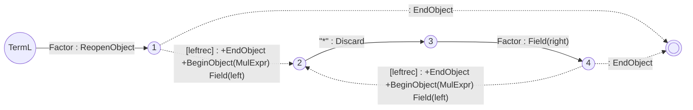

## Calc_PDA1.png

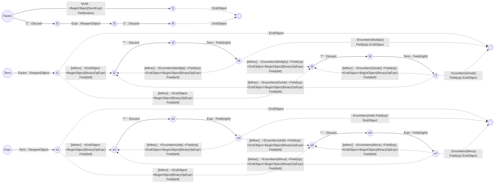

## Calc_PDA2.png

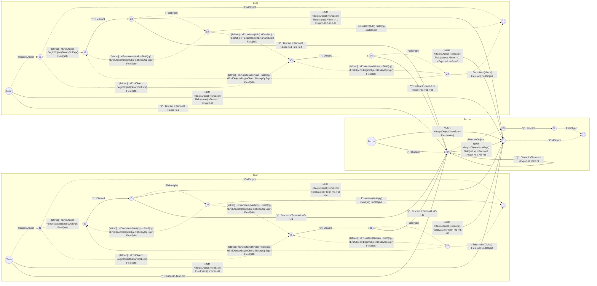

## Calc_PDA3.png

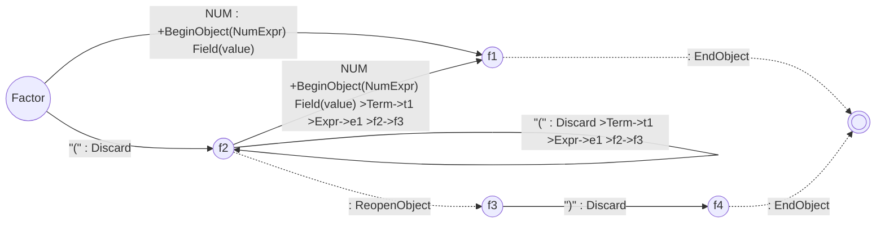

## Trace_Shape.png

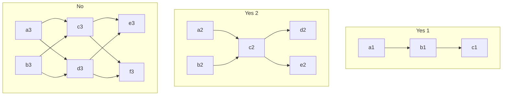

## Trace_Shape2.png

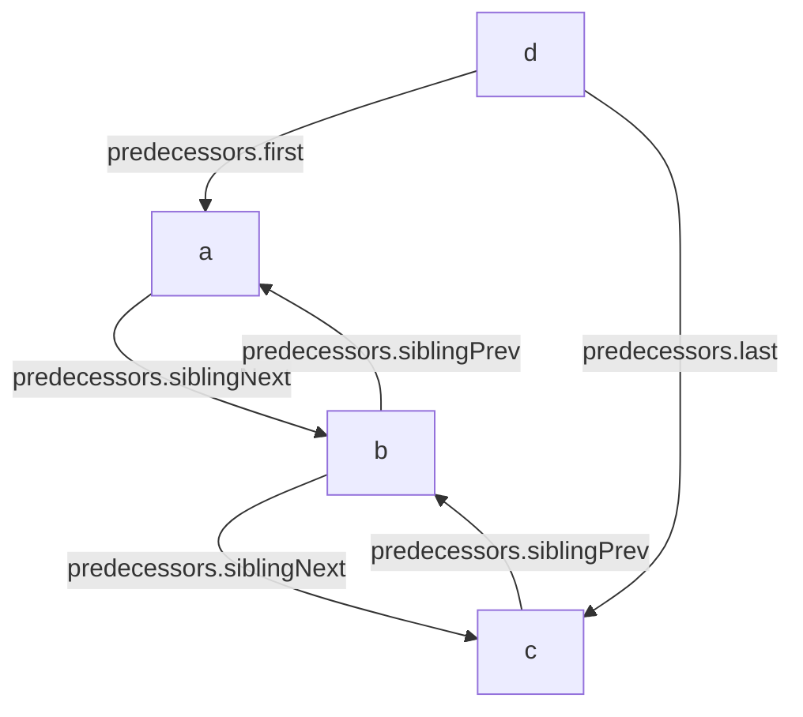

## Trace_Shape3.png

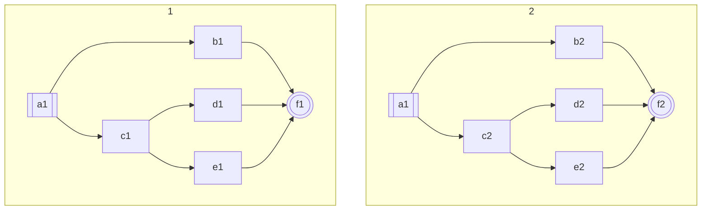