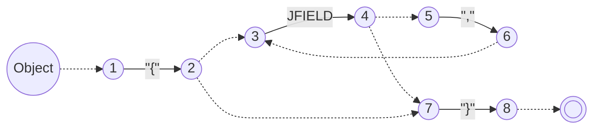
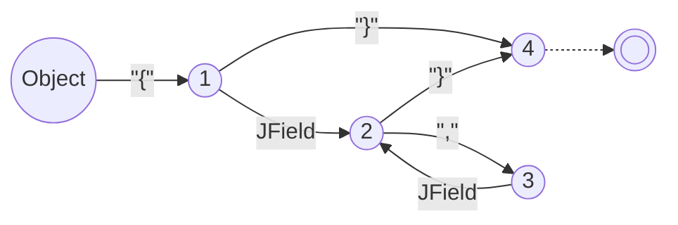
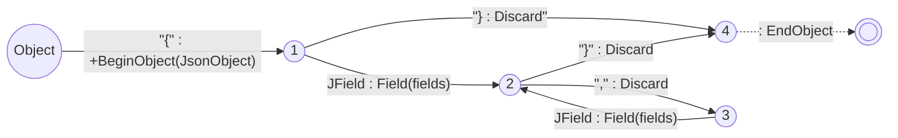

# Mermaid Flowcharts

## JSON_ENFA.png

```mermaid
graph LR
  S((Object))-.->1
  1((1))-- #quot;{#quot; -->2
  2((2))-.->3
  3((3))-- JFIELD -->4
  4((4))-.->5
  5((5))-- #quot;,#quot; --> 6
  6((6))-.->3
  4-.->7
  2-.->7
  7((7))-- #quot;}#quot; --> 8
  8((8))-.->E((( )))
```

## JSON_PDA.png

```mermaid
graph LR
  S((Object))-- #quot;{#quot; -->1
  1((1))-- #quot;}#quot; -->4
  1-- JField -->2
  2((2))-- #quot;}#quot; -->4
  2-- #quot;,#quot; -->3
  3((3))-- JField -->2
  4((4))-.->E((( )))
```

## JSON_PDA2.png

```mermaid
graph LR
  S((Object))-- #quot;{#quot; : +BeginObject(JsonObject)-->1
  1((1))-- #quot;} : Discard#quot; -->4
  1-- JField : Field(fields) -->2
  2((2))-- #quot;}#quot; : Discard -->4
  2-- #quot;,#quot; : Discard -->3
  3((3))-- JField : Field(fields) -->2
  4((4))-. : EndObject .->E((( )))
```
