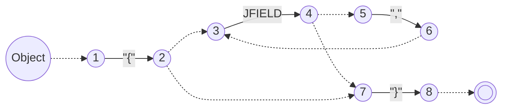
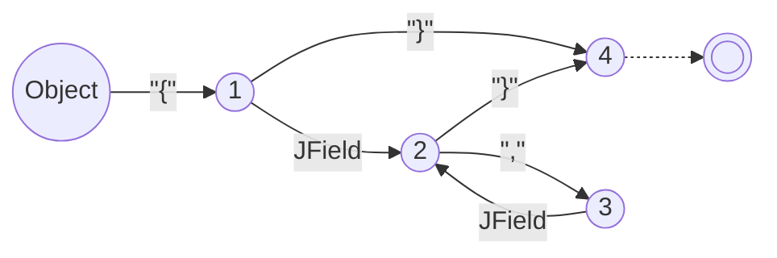
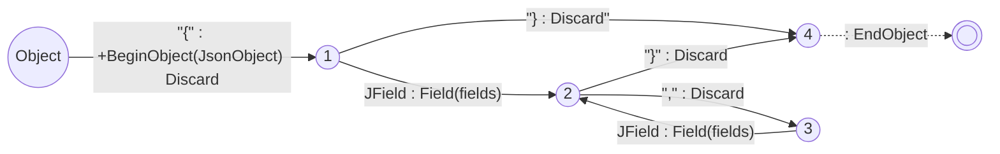
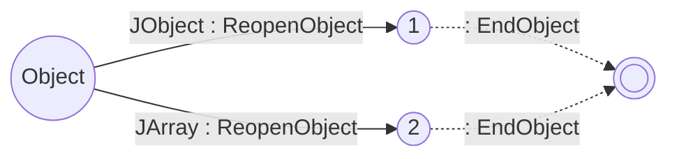
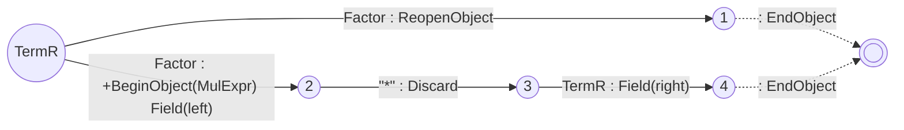
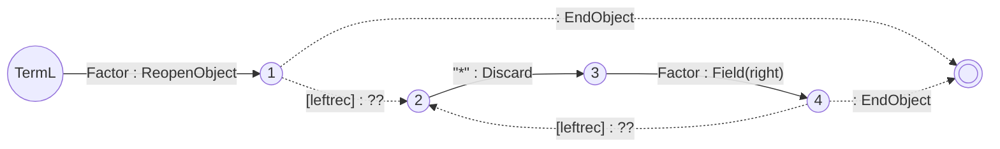
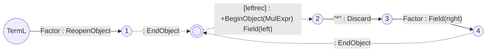
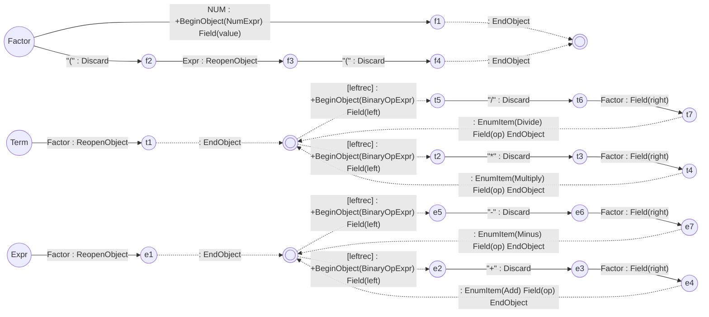

# Mermaid Flowcharts

## JSON_ENFA.png

```mermaid
graph LR
  S((Object))-.->1
  1((1))-- #quot;{#quot; -->2
  2((2))-.->3
  3((3))-- JFIELD -->4
  4((4))-.->5
  5((5))-- #quot;,#quot; --> 6
  6((6))-.->3
  4-.->7
  2-.->7
  7((7))-- #quot;}#quot; --> 8
  8((8))-.->E((( )))
```

## JSON_PDA.png

```mermaid
graph LR
  S((Object))-- #quot;{#quot; -->1
  1((1))-- #quot;}#quot; -->4
  1-- JField -->2
  2((2))-- #quot;}#quot; -->4
  2-- #quot;,#quot; -->3
  3((3))-- JField -->2
  4((4))-.->E((( )))
```

## JSON_PDA2.png

```mermaid
graph LR
  S((Object))-- #quot;{#quot; : +BeginObject(JsonObject) Discard-->1
  1((1))-- #quot;} : Discard#quot; -->4
  1-- JField : Field(fields) -->2
  2((2))-- #quot;}#quot; : Discard -->4
  2-- #quot;,#quot; : Discard -->3
  3((3))-- JField : Field(fields) -->2
  4((4))-. : EndObject .->E((( )))
```

## JSON_PDA3.png

```mermaid
graph LR
  S((Object))-- JObject : ReopenObject -->1
  1((1))-. : EndObject .->E((( )))
  S-- JArray : ReopenObject -->2
  2((2))-. : EndObject .->E
```

## Lrec_TermR.png

```mermaid
graph LR
  S((TermR))-- Factor : ReopenObject --> 1
  1((1))-. : EndObject .->E((( )))
  S-- Factor : +BeginObject(MulExpr) Field(left) -->2
  2((2))-- #quot;*#quot; : Discard -->3
  3((3))-- TermR : Field(right) --> 4
  4((4))-. : EndObject .->E
```

## Lrec_TermL.png

```mermaid
graph LR
  S((TermL))-- Factor : ReopenObject --> 1
  1((1))-. : EndObject .->E((( )))
  S-- TermL : +BeginObject(MulExpr) Field(left) -->2
  2((2))-- #quot;*#quot; : Discard -->3
  3((3))-- Factor : Field(right) --> 4
  4((4))-. : EndObject .->E
```

## Lrec_TermL2.png

```mermaid
graph LR
  S((TermL))-- Factor : ReopenObject --> 1
  1((1))-. : EndObject .->E((( )))
  2((2))-- #quot;*#quot; : Discard -->3
  3((3))-- Factor : Field(right) --> 4
  4((4))-. : EndObject .->E
  1-. [leftrec] : ?? .->2
  4-. [leftrec] : ?? .->2
```

## Lrec_TermL2.png

```mermaid
graph LR
  S((TermL))-- Factor : ReopenObject --> 1
  1((1))-. : EndObject .->E((( )))
  2((2))-- #quot;*#quot; : Discard -->3
  3((3))-- Factor : Field(right) --> 4
  4((4))-. : EndObject .->E
  E-. [leftrec] : +BeginObject(MulExpr) Field(left) .->2
```

## Calc_PDA1.png

```mermaid
graph LR
  fS((Factor))-- NUM : +BeginObject(NumExpr) Field(value) --> f1
  f1((f1))-. : EndObject .->fE((( )))
  fS-- #quot;(#quot; : Discard --> f2
  f2((f2))-- Expr : ReopenObject --> f3
  f3((f3))-- #quot;(#quot; : Discard -->f4
  f4((f4))-. : EndObject .->fE

  tS((Term))-- Factor : ReopenObject --> t1
  t1((t1))-. : EndObject .->tE((( )))
  t2((t2))-- #quot;*#quot; : Discard -->t3
  t3((t3))-- Factor : Field(right) --> t4
  t4((t4))-. : EnumItem(Multiply) Field(op) EndObject .->tE
  tE-. [leftrec] : +BeginObject(BinaryOpExpr) Field(left) .->t5
  t5((t5))-- #quot;/#quot; : Discard -->t6
  t6((t6))-- Factor : Field(right) --> t7
  t7((t7))-. : EnumItem(Divide) Field(op) EndObject .->tE
  tE-. [leftrec] : +BeginObject(BinaryOpExpr) Field(left) .->t2

  eS((Expr))-- Factor : ReopenObject --> e1
  e1((e1))-. : EndObject .->eE((( )))
  e2((e2))-- #quot;+#quot; : Discard -->e3
  e3((e3))-- Factor : Field(right) --> e4
  e4((e4))-. : EnumItem(Add) Field(op) EndObject .->eE
  eE-. [leftrec] : +BeginObject(BinaryOpExpr) Field(left) .->e5
  e5((e5))-- #quot;-#quot; : Discard -->e6
  e6((e6))-- Factor : Field(right) --> e7
  e7((e7))-. : EnumItem(Minus) Field(op) EndObject .->eE
  eE-. [leftrec] : +BeginObject(BinaryOpExpr) Field(left) .->e2
```