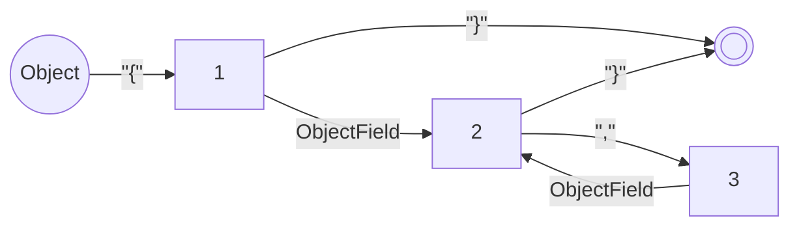

# Mermaid FLowcharts

## JSON

```mermaid
graph LR
  S((Object))-- #quot;{#quot; -->1
  1-- #quot;}#quot; -->E((( )))
  1-- ObjectField -->2
  2-- #quot;}#quot; -->E
  2-- #quot;,#quot; -->3
  3-- ObjectField -->2
```
