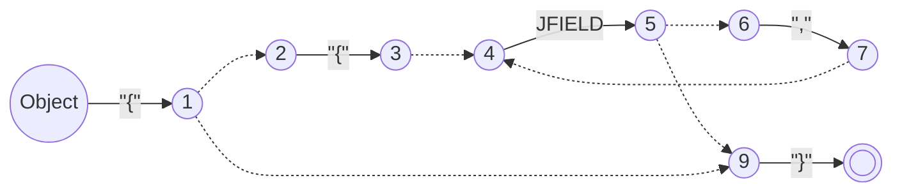
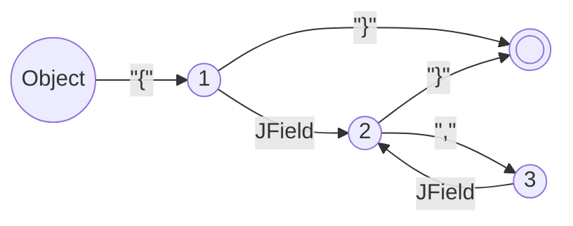

# Mermaid FLowcharts

## JSON

```mermaid
graph LR
  S((Object))-- #quot;{#quot; -->1
  1((1))-.->2
  2((2))-- #quot;{#quot; -->3
  3((3))-.->4
  4((4))-- JFIELD -->5
  5((5))-.->6
  6((6))-- #quot;,#quot; --> 7
  7((7))-.->4
  5-.->9
  1-.->9
  9((9))-- #quot;}#quot; --> E((( )))
```

```mermaid
graph LR
  S((Object))-- #quot;{#quot; -->1
  1((1))-- #quot;}#quot; -->E((( )))
  1-- JField -->2
  2((2))-- #quot;}#quot; -->E
  2-- #quot;,#quot; -->3
  3((3))-- JField -->2
```
