# Mermaid Flowcharts

## JSON_ENFA.png

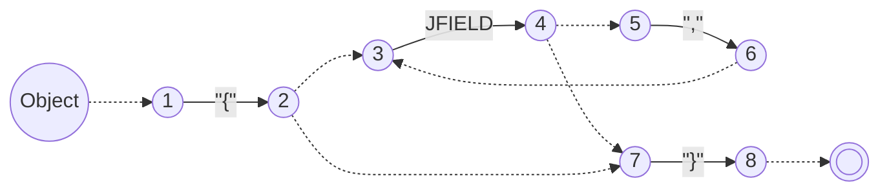

## JSON_PDA.png

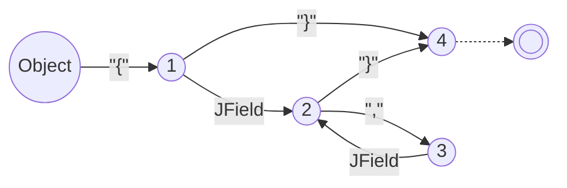

## JSON_PDA2.png

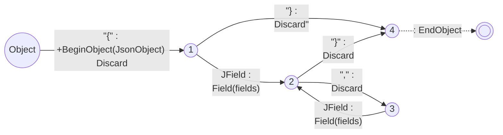

## JSON_PDA3.png

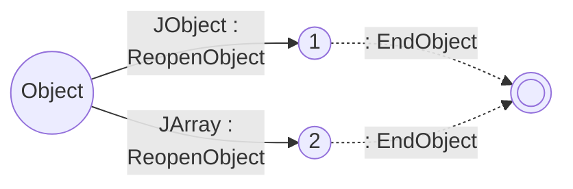

## Lrec_TermR.png

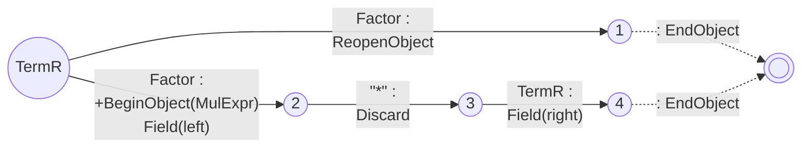

## Lrec_TermL.png

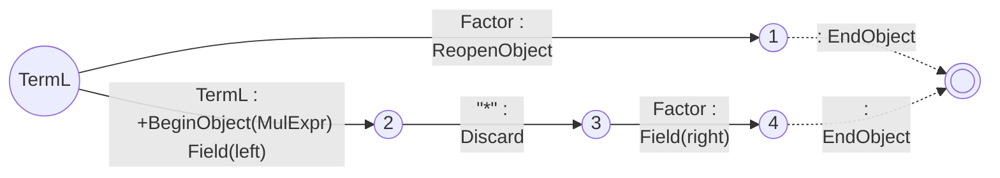

## Lrec_TermL2.png

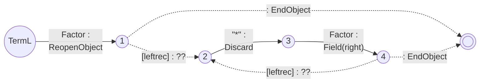

## Lrec_TermL3.png

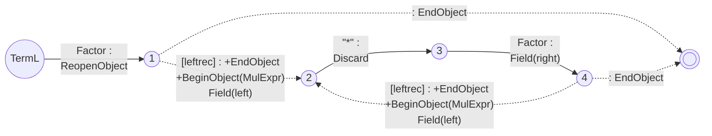

## Calc_PDA1.png

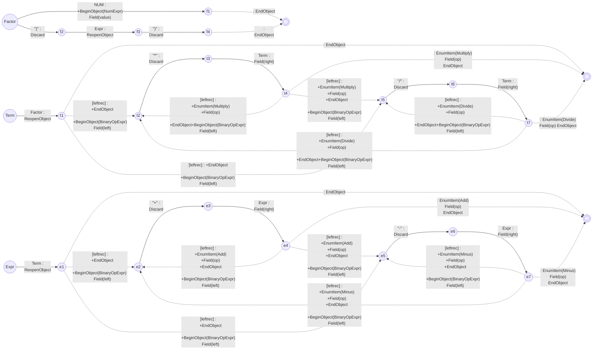

## Calc_PDA2.png

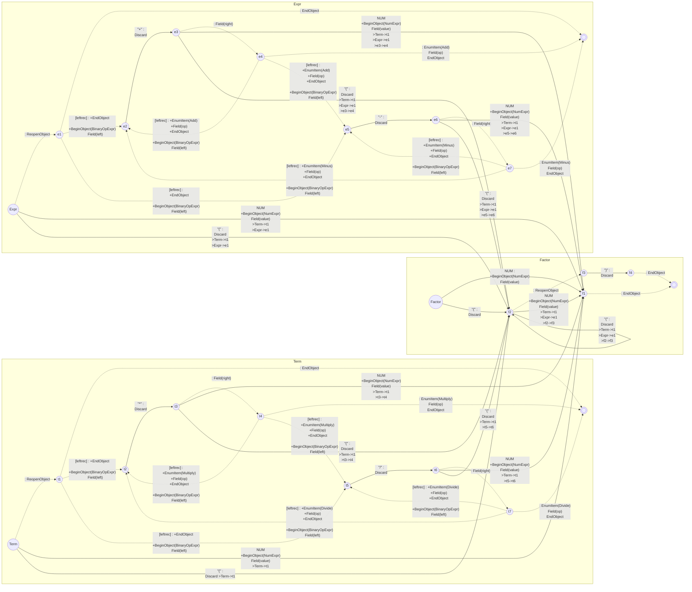

## Calc_PDA3.png

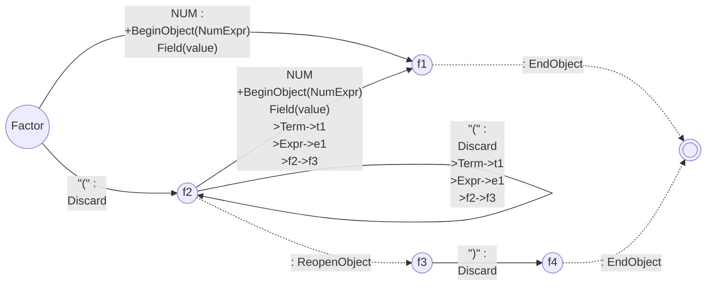

## Trace_Shape.png

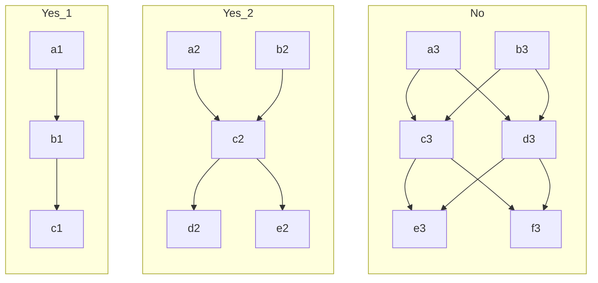

## Trace_Shape2.png

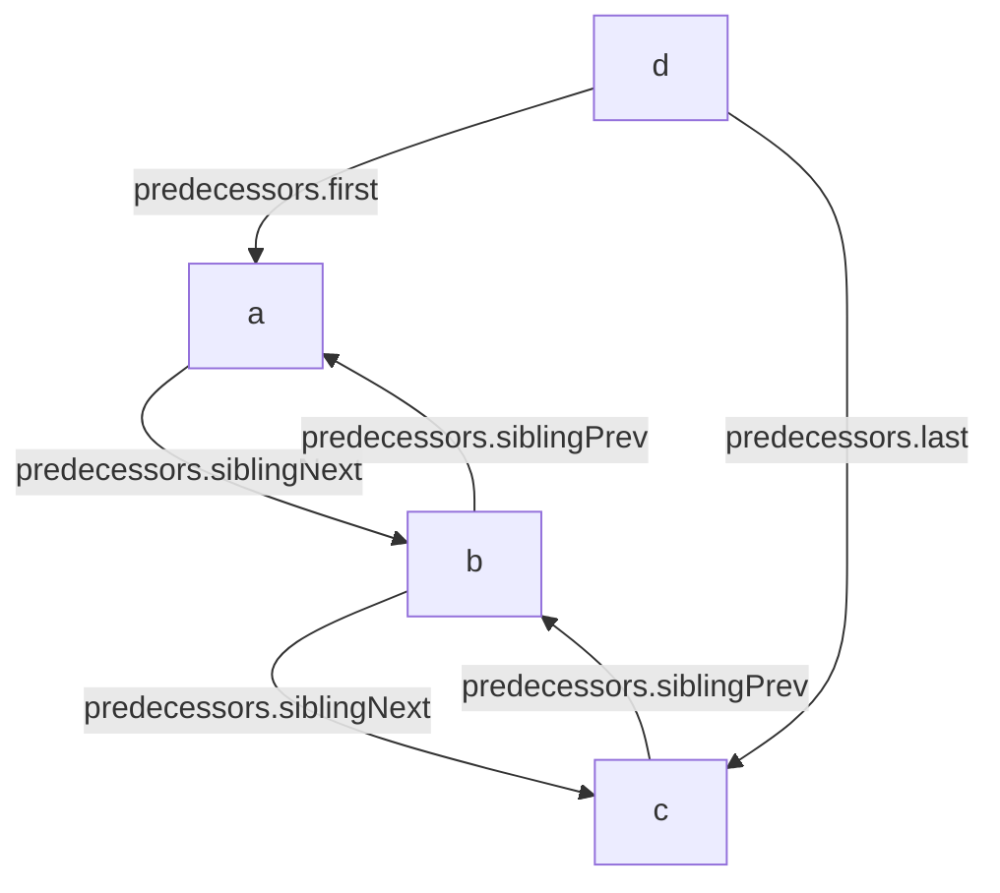

## Trace_Shape3_1.png

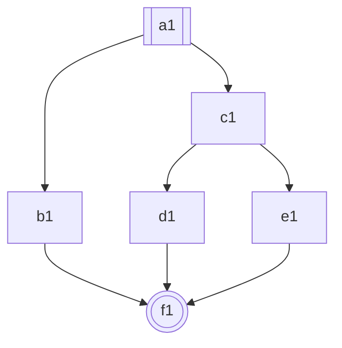

## Trace_Shape3_2.png

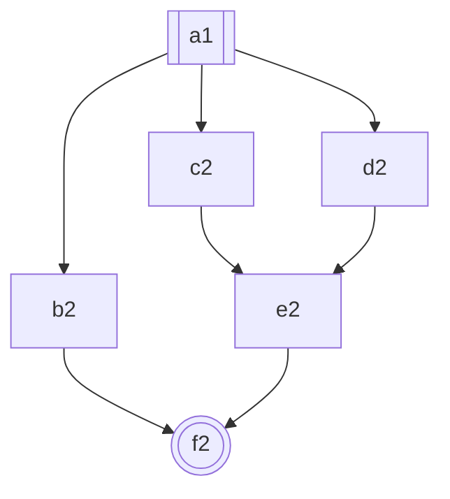

## Trace_Shape3_3.png

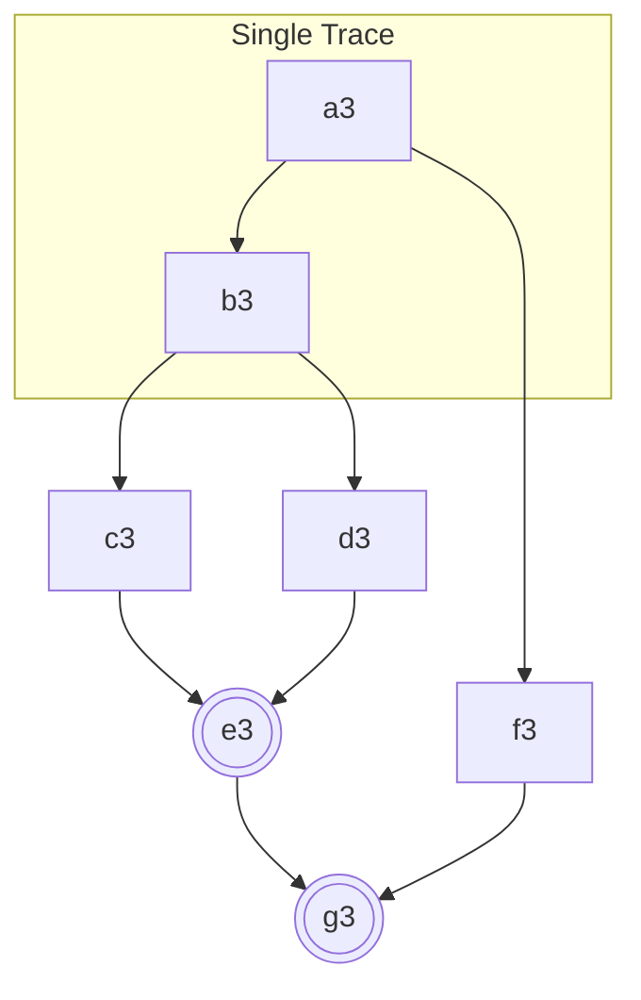

## Trace_Shape3_4.png

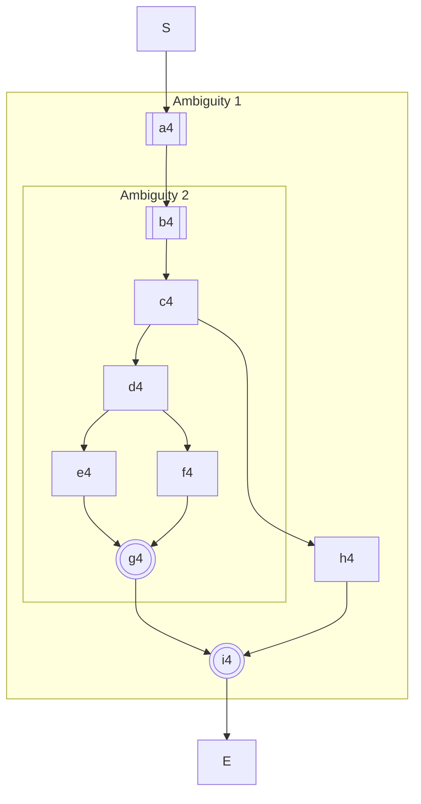

## DFA_PDA1.png

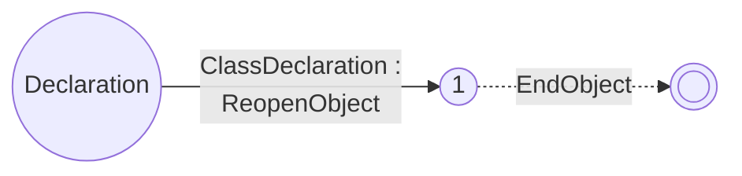

## DFA_PDA2.png

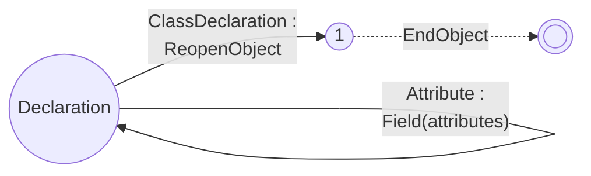

## DFA_PDA3.png

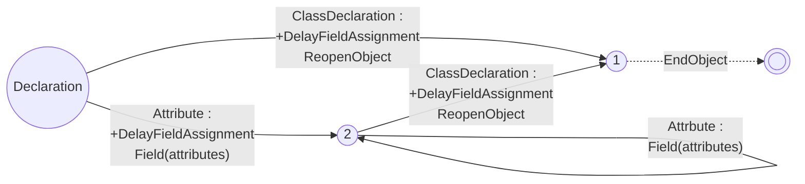

## New_Lrec_TermL3.png

```mermaid
graph LR
  S((TermL))-- Factor :
    StackBegin --> 1
  1((1))-. : StackEnd .->E((( )))
  2((2))-- #quot;*#quot; :
    Discard --> 3
  3((3))-- Factor :
    StackSlot(2) --> 4
  4((4))-. : CreateObject(MulExpr)
    Field(left, 0)
    Field(right, 2)
    StackEnd .->E
  1-. [leftrec] :
    StackEnd
    StackBegin
    StackSlot(0) .->2
  4-. [leftrec] :
    CreateObject(MulExpr)
    Field(left, 0)
    Field(right, 2)
    StackEnd
    StackBegin
    StackSlot(0) .->2
```

## Trace_Shape3_4_1.png

```mermaid
graph LR
  b4[[b4]]-->c4-->d4 --> e4 & f4 --> g4(((g4)))
```

## Trace_Shape3_4_2.png

```mermaid
graph LR
  S[[BEGIN]]-->b4_1[b4]-->c4_1[c4]-->d4_1[d4]-->e4_1[e4]-->R_1[[BRANCH]]
  S-->b4_2[b4]-->c4_2[c4]-->d4_2[d4]-->f4_2[f4]-->R_2[[BRANCH]]
  R_1 & R_2 --> R[[RESOLVE]] --> g4(((g4)))
```

## Trace_Shape3_4_3.png

```mermaid
graph LR
  S[[BEGIN]]-->b4_1[b4]-->c4_1[c4]-->d4_1[d4]-->e4_1[e4]-->R_1[[BRANCH]]
  R_1-->b4_2[b4]-->c4_2[c4]-->d4_2[d4]-->f4_2[f4]-->R_2[[BRANCH]]
  R_2-->R[[RESOLVE]]-->g4(((g4)))
```

## Trace_Shape3_4_4.png

```mermaid
graph LR
  a4[[a4]]-->b4_g4[["b4..g4"]]
  a4-->b4-->c4-->h4
  b4_g4 & h4-->i4(((i4)))
```

## Trace_Shape3_4_5.png

```mermaid
graph LR
  S[[BEGIN]]-->a4_1[a4]-->b4_g4[["b4..g4"]]-->R_1[[BRANCH]]
  S-->a4_2[a4]-->b4-->c4-->h4-->R_2[[BRANCH]]
  R_1 & R_2 --> R[[RESOLVE]] --> i4(((i4)))
```

## Trace_Shape3_4_6.png

```mermaid
graph LR
  S[[BEGIN]]-->a4_1[a4]-->b4_g4[["b4..g4"]]-->R_1[[BRANCH]]
  R_1-->a4_2[a4]-->b4-->c4-->h4-->R_2[[BRANCH]]
  R_2-->R[[RESOLVE]]-->i4(((i4)))
```

## Parser_Compile.png

```mermaid
graph TD
  AST_FILE_1[[Ast1.txt]] -- TypeParser::ParseFile() --> AST_1[GlrAstFile]
  AST_FILE_2[[Ast2.txt]] -- TypeParser::ParseFile() --> AST_2[GlrAstFile]
  AST_1 & AST_2 -- CompileAst --> AST_MGR[AstSymbolManager]

  LEXER_FILE[[Lexer.txt]] -- CompileLexer() --> LEXER_MGR[LexerSymbolManager]
  
  SYNTAX_FILE_1[[Syntax1.txt]] -- RuleParser::ParseFile() --> SYNTAX_1[GlrSyntaxFile]
  SYNTAX_FILE_2[[Syntax2.txt]] -- RuleParser::ParseFile() --> SYNTAX_2[GlrSyntaxFile]
  AST_MGR & LEXER_MGR & SYNTAX_1 & SYNTAX_2 -- CompileSyntax() --> AST_MGR_1[SyntaxSymbolManager]

  AST_MGR_1 -- SyntaxSymbolManager::BuildCompactNFA() --> AST_MGR_2[w/ prefix merging]
  AST_MGR_2 -- SyntaxSymbolManager::BuildCrossReferencedNFA() --> AST_MGR_3[w/ only token transition ]
  AST_MGR_3 -- SyntaxSymbolManager::BuildAutomaton() --> AUTOMATON[Executable + Metadata]

  AUTOMATON -- Executable::Serialize --> BINARY[[Compressed Automaton]]
  AST_MGR -- WriteAstFiles() --> AST_GEN_FILE[["Ast.cpp + Assembler.cpp"]]
  LEXER_MGR -- WriteLexerFiles() --> LEXER_GEN_FILE[["Lexer.cpp"]]
  BINARY -- WriteSyntaxFile() --> SYNTAX_GEN_FILE[["Syntax.cpp"]]
```

## Parser_Executte.png

```mermaid
graph TD
  LEXER_GEN_FILE_2[["Lexer.cpp"]] --> LEXER[RegexLexer]
  INPUT[[Input.txt]] & LEXER -- Tokenize() --> TOKENS[List#lt;RegexToken#gt;]
  SYNTAX_GEN_FILE_2[["Syntax.cpp"]] -- Executable::Executable() --> EXECUTABLE[[Executable]]
  EXECUTABLE -- CreateExecutor() --> TRACE_MGR[TraceManager]
  TOKENS & TRACE_MGR -- Input/EndOfInput --> TRACE_MGR2[w/ Traces]
  TRACE_MGR2 -- PrepareTraceRoute() --> TRACE_MGR3[w/ Partial Execution]
  TRACE_MGR3 -- CheckMergeTraces() --> TRACE_MGR4[w/ TraceAmbiguity]
  TRACE_MGR4 -- BuildExecutionOrder() --> STEPS[ExecutionStep]
  TRACE_MGR2 -. (if not ambiguity involved) .-> STEPS
  AST_GEN_FILE_2[["Assembler.cpp"]] & TOKENS & STEPS --> AST(((Parsed AST)))
```