# 记录GLR Parser的重构，GacUI的起源，论打补丁和技术债的恶性循环，以及其他软件工程上的感悟的流水账

> 如果当初多想一下的话，就会发现其实我们已经在破坏自己的抽象了，正在实践[依赖巧合编程](https://en.wikipedia.org/wiki/Programming_by_permutation)...，破坏了封装。这位后面的灾难埋下了伏笔。而且打补丁真的很容易成为一个人下意识的选择，因为每一个补丁都太小了...，甚至都意识不到自己在打补丁，令人麻痹大意，温水煮青蛙也。没有在需要重构的时候马上动手，就会有越来越多的代码依赖错误的设计，总有一天会改不动。这个时候要么你真的特别牛逼把重构做出来，要么重写，要么就[干脆放弃](https://en.wikipedia.org/wiki/The_Mythical_Man-Month)。

> 不过换个角度，如今的资本主义社会令码农并不能在法律上产生对代码的ownership，其实你写的都是别人的东西，到底要不要容忍[错误的实践](https://en.wikipedia.org/wiki/List_of_software_anti-patterns)，其实也见仁见智了。不过是否执行好的实践，最好只是你的一个选择，而不是受限于你的能力。所以下班后折腾自己的项目，亲自体验这些东西，我认为都是很有必要的。特别是LLM时代AI把屎一车一车的运到屎山上喷，如果你不具备这种能力，项目可能在你可以离职前就已经光速崩掉了，那这就不好办了。就算你上班用不上AI，下班后用AI喷屎然后自己铲干净，也是一种练习。

此刻正是2025的圣诞节。项目的起源还得从许久以前说起。回顾这一路走来的过程，先是中学的时候为了开发游戏制作第一个游戏引擎随后对编译原理产生了兴趣；接着就是在大学时期先后实现了垃圾收集器、C语言子集一路做到汇编器、和一个Haskell子集的类型推导；毕业后又借机把type class加到了C语言上面。

这个过程没有光做编译器，还是图给所有的这些东西做编辑器，包括上下文有关着色和自动完成等一系列IDE的标准功能都是用C#做的。编译器是C++写的但是编辑器是C#写的，于是我从parser到类型推导都分别用C++和C#各做了一遍，这怎么想都是不对的。

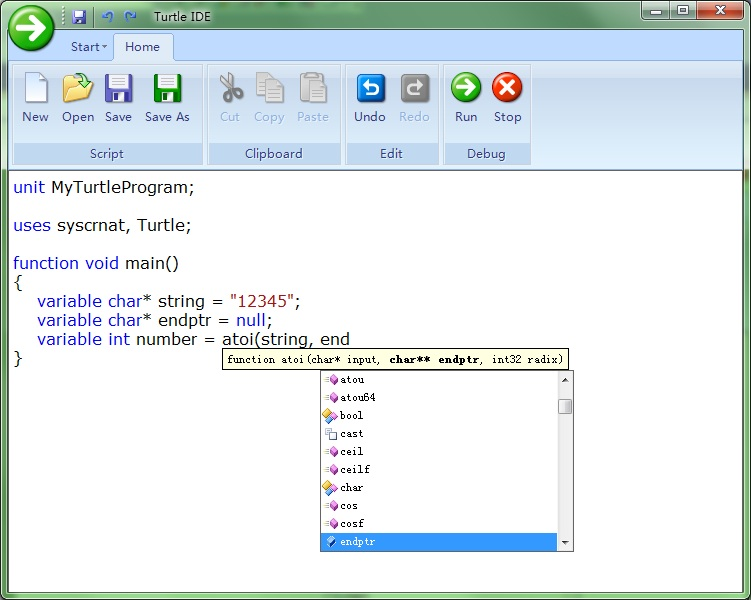

不过这其实才是现实世界里大家的普遍原则。想想当时地球上爆火的几款代码编辑器，分别有正在（已经）用C#和XAML重写的Visual Studio、用Jvav写的Eclipse、用Jvav写的一系列不同语言的IDE、还有马上就要诞生的TypeScript写的vscode。它们哪个不是一个语言的前端做了好几遍？要么就是编译器和编辑器是不同地方的人做的，要么语言本身就没有自举，或者自举了但完全没考虑过编辑器的需要。比如微软明明用C++写了编译器和VS，但是VS用的却是Edison Design Group实现的C++前端；比如原本用C++写的C#编译器后面用C#重写了（Roslyn）；比如原本用JS写的TS然后换TS又写了一遍然后换go又写了一遍；似乎分开做才是业界常态。

但我自己做又没有类似的问题，于是怀揣着编译器和编辑器共享一套编译器前端的想法，就有了[vczh-libraries/GacUI](https://github.com/vczh-libraries/GacUI)，以及为了实现语法分析和给语义着色和自动完成打基础的VlppParser和VlppParser2（整个重写过）。故事便从[VlppParser](https://github.com/vczh-libraries/VlppParser)和[VlppParser2](https://github.com/vczh-libraries/VlppParser2)这里发生。此时正是大学刚毕业的时候，所以VlppParser的设计还能看见当初在大学的时候诞生的很多想法。

## 一个JSON parser

Parser是怎么运行起来的呢？阅读[JSON的官网](https://www.json.org/json-en.html)我们可以迅速写出它的[词法和语法](https://en.wikipedia.org/wiki/Extended_Backus%E2%80%93Naur_form)：

```
TRUE_VALUE:true
FALSE_VALUE:false
NULL_VALUE:null
OBJOPEN:\{
OBJCLOSE:\}
ARROPEN:\[
ARRCLOSE:\]
COMMA:,
COLON::
NUMBER:[\-]?\d+(.\d+)?([eE][+\-]?\d+)?
STRING:"([^\\"]|\\[^u]|\\u\d{4})*"
discard SPACE:\s+
```

[VlppRegex](https://github.com/vczh-libraries/VlppRegex)会处理这些正则表达式，然后把它们合并成一个[DFA](https://en.wikipedia.org/wiki/Deterministic_finite_automaton)。合并DFA的好处就是可以让你一个一个字符跑到token结束的时候正好知道他命中了上面的哪一行。

如果一个正则表达式已经封装好了，就很难做出这样的功能,所以当初就自己做了一个。以前用C#还是TypeScript写类似的东西，就真的一个一个正则表达式去试。正则表达式会有很多超出DFA表达能力的功能，所以这里面其实有两套实现，如果发现能用DFA那就走DFA，不能的就走另一套。但是词法分析器是不允许使用那些高级功能的，因此可以在每个正则表达式生成DFA之后继续往下做。

这个时候JSON字符串已经变成一个一个的token，而且每个token还标记出了它的名字，那么就可以跑语法了。语法里面的`@parser`标记是为了辅助生成C++代码用的，标记了`@parser`的语法都会生成几个helper，把背后的东西都打包在一起。

```
JLiteral
	::= STRING
	::= NUMBER
	::= "true"
	::= "false"
	::= "null"
	;

JField
	::= STRING ":" JValue
	;

JObject
	::= "{" {JField ; ","} "}"
	;

JArray
	::= "[" {JValue ; ","} "]"
	;

JValue
	::= JLiteral
	::= JObject
	::= JArray
	;

@parser JRoot
	::= JObject
	::= JArray
	;
```

以`JObject`为例，我们可以直接生成他的[epsilon-NFA](https://en.wikipedia.org/wiki/Nondeterministic_finite_automaton)。其中`{a ; b}`是一个缩写，展开后会变成`[a {b a}]`，但是生成PDA的时候是直接处理的，这样就免去了重复计算：

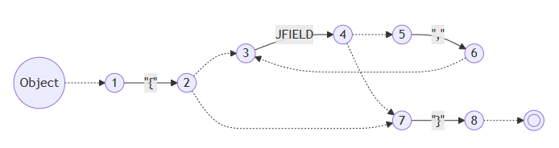

然后还是当他正则表达式那样做，把rule input和token input都先当成不一样的原子输入看，生成它的DFA。当然这并不是真的DFA，他是一个[PDA](https://en.wikipedia.org/wiki/Pushdown_automaton)，因为rule之间或者rule/token之间是会存在包含关系或者共享前缀的，但是先不管，后面自有办法：


后面还有一系列复杂的处理，但总之我们还是得到了一个能跑的东西了。于是给一个JSON字符串，现在我们可以验证他是不是一个合法的JSON了，从`JROOT`开始运行，如果把所有token都吃掉的同时正好跑到状态机的最后一个状态，就说明成功了。费了这么大劲就搞出这么个东西？当然不是，我们的目标是生成JSON的语法树。

### 语法的副作用

既然要生成语法树，那就得继续往语法上加信息。经过短暂地思考，就可以知道一行语法大概需要做的事情有：
- 构造语法树的一个对象，比如`JObject`
- 把别人的语法树拿过来，比如`JValue ::= JObject`，这样`JValue`可能会生成好几个不同的东西
- 不仅要把语法树拿过来，还要对他继续做修改，这个在JSON里暂时还不存在，后面会提到

此时语法的表达就不是特别的简洁了，慢慢罗嗦起来，但是至少为了[写上最必要的信息](https://github.com/vczh-libraries/VlppParser2/blob/master/Source/Json/Syntax/Syntax.txt)，我们还是得到了

```
...

JObject
	::= "{" {JField:fields ; ","} "}" as Object
	;

...

@parser JRoot
	::= !JObject
	::= !JArray
	;
```

为了解释加进去的信息的意思，我们还需要定义[JSON语法树的结构](https://github.com/vczh-libraries/VlppParser2/blob/master/Source/Json/Syntax/Ast.txt)：

```
class Node
{
}

...

class Object : Node
{
    var fields : ObjectField[];
}
```

最后只要把这些信息都加入到上面生成的PDA就可以了。一个很自然的想法就是，既然parse一个JSON无非就是从`JROOT`的状态机开始跑到完，那只要一边跑一边构造语法树就行了。从一个状态到另一个状态转移（transition）的时候，我们需要看下一个token是什么，从这个状态出发的那么多transition里选中我们想要的，顺便就可以做点事。

“做点事”到底做什么事呢？现在我们已经从上面的语法树的定义[生成了它的C++代码](https://github.com/vczh-libraries/VlppParser2/blob/master/Source/Json/Generated/JsonAst.h)，那就先来看看，假如我们需要生成`{"a": "b"}`的语法树，我们需要做什么：

```C++
auto obj = Ptr(new JsonObject);
{
  auto field = Ptr(new JsonField);
  field->name.value = L"a";
  {
    auto value = Ptr(new JsonString);
    value->content.value = L"b";
    field->value = value;
  }
  obj->fields.Add(field);
}
```

pattern一下就看出来了。一个很自然的想法就是，我们可以设计一个指令集，就专门用来生成语法树。每一个transition带了一些指令，而运行指令就等于运行一些特定的函数，而这些函数就可以从语法树的定义里生成出来。那首先我们要补齐读token的动作：

```C++
auto obj = Ptr(new JsonObject);
{
  NextToken();                         // {这个token是不要的，但是又必须把他读掉
  auto field = Ptr(new JsonField);
  {
    auto token = NextToken();          // "a"
    field->name = token;
  }
  NextToken();                         // :
  {
    auto str = Ptr(new JsonString);
    {
      auto token = NextToken();        // "b"
      str->content = token;
    }
    field->value = str;
  }
  obj->fields.Add(field);
  NextToken();                         // "}"
}
```

然后令他变得抽象：

```
BeginObject(Object)
  Token                  // {
  Discard
  BeginObject(Field)
    Token                // "a"
    Field(name)
    Token                // :
    Discard
    BeginObject(String)
      Token              // "b"
      Field(content)
    EndObject
    Field(value)
  EndObject
  Field(fields)
  Token                  // }
  Discard
EndObject
```

一切看起来都很美好，指令跟C++代码简单的对应起来了，实现它应该不费吹灰之力。我们不妨把它称之为“BeginObject指令集”。

### 实现BeginObject指令集

指令集的表达是独立的，但是具体构造的类型又是生成的代码，所以中间需要一些设计模式的支持，这些对各位来说应该跟喝水一样简单了。但是我们还是可以讨论一下这些指令到底干了什么。`BeginObject`是嵌套的，所以它需要一个堆栈。Field就可以从堆栈里拿东西出来，写到成员变量里面去。但是我们怎么知道栈顶的对象到底经历了`EndObject`没有呢？这个好说，干脆把堆栈一分为二，`EndObject`就可以从堆栈1把东西pop出来push到堆栈2，`Token`可以把token也压到堆栈2，那么`Field`就可以从堆栈2把对象pop进成员变量了。我们不妨把他们命名为`Create堆栈`和`Object堆栈`：

```
BeginObject(type) = { cs.Push(Create(type)); }
Token = { os.Push(NextToken()); }
Discard = { os.Pop(); }
Field(field) = { cs.Top().SetField(field, os.Pop()); }
EndObject = { os.Push(cs.Pop()); }
```

于是我们就可以把这些指令都加到上面的PDA的transition里面去。需要注意的是，带`+`的指令说明它是在transition真正做出动作之前（比如`NextToken()`，比如进入`JField`对应的另一个PDA里）执行的：

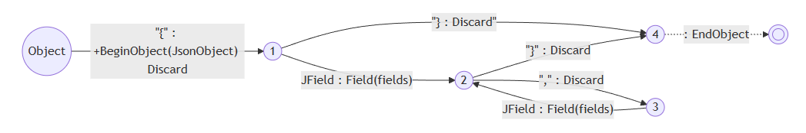

最后我们把`{"a": "b"}`送进`JRoot`，一顿分析，最后一看Create堆栈（cs）是空的，Object堆栈（os）剩下一个对象，好的！我们的语法树完成了。

等等！还记得我们的`JRoot`吗？

```
@parser JRoot
	::= !JObject
	::= !JArray
	;
```

这个“直接把东西拿来用”的`!`又要怎么表达呢？回顾一下上面说的，一行语法要做的事情有三件：
- 构造语法树的一个对象，比如`JObject`
- 把别人的语法树拿过来，比如`JValue ::= JObject`，这样`JValue`可能会生成好几个不同的东西
- 不仅要把语法树拿过来，还要对他继续做修改，这个在JSON里暂时还不存在，后面会提到

我们可以把2和3做在一起，`JRoot`看到`!JObject`就把已经在Object堆栈里面的`JObject`重新放回Create堆栈里，再进行一顿修改之后放回去就好，因此我们只需要加入一个新的指令：

```
ReopenObject = { cs.Push(os.Pop()); }
```

因为`JRoot ::= !JObject`，所以JRoot不能有自己的BeginObject指令了。下面的BeginObject(JObject)...EndObject是属于`JField`的：

```
// JRoot没有BeginObject
  BeginObject(JObject)
    ...
  EndObject
  ReopenObject
EndObject
```

此时的味道已经不太好了，感觉就像给指令集打了个补丁，不过因为这个补丁实在是太过于直接而且合理，而且`EndObject`和`ReopenObject`的这件事让我莫名感到快乐，就像是推导出了理所当然的结构一样，当时并没有想到以后会造成那么多问题，补丁一个一个像滚雪球一样堆上去，直到不得不推翻重来两遍。但是我们先不管，先来看看`JRoot`的PDA：

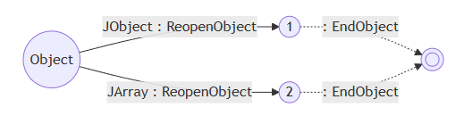

## 四则运算与左递归

一样是循环，上面生成的AST是数组，但是如果我们想递归怎么办？考虑一个二元运算符的例子，比如说乘法。假如他是右结合或者左结合，分别会有两种写法：

```
Factor
  ::= NUM:value as NumExpr
  ;

TermR
  ::= !Factor
  ::= Factor:left "*" TermR:right as MulExpr
  ;

TermL
  ::= !Factor
  ::= TermL:left "*" Factor:right as MulExpr
  ;
```

TermR和TermL的PDA分别如下：

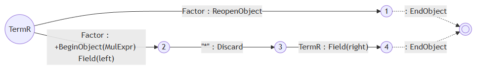
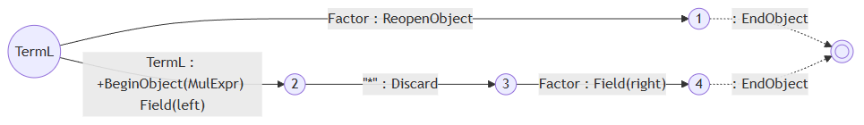

对于右递归，有一个明显的优化问题摆在眼前，就是`TermR`出来有两个分支都是`Factor`，必须把它合并。但是由于他们各自的指令不同，合并了有会有一些其他问题。而且由于[GLR parser](https://en.wikipedia.org/wiki/GLR_parser)的特点，就算不管他也不会影响正确性，只是会浪费点时间parse两次`Factor`然后丢掉其中一个。所以一开始我并没有管，而且它会被一个更大的更麻烦的问题所包含。这个部分会在文章靠后的地方找到。

对于左递归，显然这并不是一个优化问题。输入是`1`的时候走上分支，输入是`1*2`的时候走下分支，输入是`1*2*3`的时候要走下分支两次。但是仔细想想就会发现，走下分支就马上回到自己，然后你必须要立刻做出选择，这相当于你需要预测后面有多少`*`，显然是不可能的。我们只能化递归为循环。如果我们在语法上做循环，会发现做不出来想要的左结合的语法树，因此我们在PDA上想办法。

要化为循环，就需要确定循环的开始和结束，而这很明显是要做出`Factor {"*" Factor}`的效果。因此不管是第一个分支的`Factor`结束或者是第二个分支的`Factor`结束他都要回到`"*"`，于是我们可以在PDA上把这两个transition做出来，同时就要断开所有左递归语法的第一个输入：

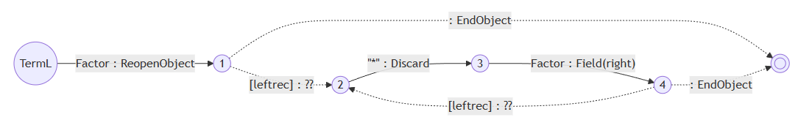

这个新出来的transition的指令应该填什么呢？显然再也不可能把`1*2`的`BeginObject(MulExpr)`放在`1`的外面了，否则你就要面临“到底需要提前放几个`BeginObject(MulExpr)`的问题”，问题等于没解决。所以在执行指令的时候，`1`只能放在`BeginObject(MulExpr)`的前面，而且接下来的`Field(left)`还得读到`1`产生的。不过我们马上就能发现：

```
BeginObject(MulExpr)
  BeginObject(NumExpr) ... EndObject
  Field(left)
```

和

```
BeginObject(NumExpr) ... EndObject
BeginObject(MulExpr)
  Field(left)
```

的效果竟然是一样的，因为按照前面的伪代码展开，我们会得到

```
cs.Push(Create(type));
os.Push(NumExpr from "1");
cs.Top().SetField(MulExpr::left, os.Pop());
```

和

```
os.Push(NumExpr from "1");
cs.Push(Create(type));
cs.Top().SetField(MulExpr::left, os.Pop());
```

这意味着我们只需要原封不动地复制原来`TermL`到`2`的transition的指令集就好了，于是我们得到了：

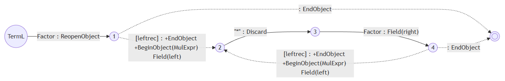

<!--
### 打补丁本质上是一个靠温水煮青蛙积累技术债的行为

如果当初多想一下的话，就会发现其实我们已经在破坏自己的抽象了，正在实践[依赖巧合编程](https://en.wikipedia.org/wiki/Programming_by_permutation)。我们没有使用`BeginObject`们的语义，反而在利用他们的实现，破坏了封装。这位后面的灾难埋下了伏笔。而且打补丁真的很容易成为一个人下意识的选择，因为每一个补丁都太小了，比如上面实现左递归甚至不需要修改状态机本身的定义和实现，甚至都意识不到自己在打补丁，令人麻痹大意，温水煮青蛙也。没有在需要重构的时候马上动手，就会有越来越多的代码依赖错误的设计，总有一天会改不动。这个时候要么你真的特别牛逼把重构做出来，要么重写，要么就[干脆放弃](https://en.wikipedia.org/wiki/The_Mythical_Man-Month)。

不过换个角度，如今的资本主义社会令码农并不能在法律上产生对代码的ownership，其实你写的都是别人的东西，到底要不要容忍[错误的实践](https://en.wikipedia.org/wiki/List_of_software_anti-patterns)，其实也见仁见智了。不过是否执行好的实践，最好只是你的一个选择，而不是受限于你的能力。所以下班后折腾自己的项目，亲自体验这些东西，我认为都是很有必要的。特别是LLM时代AI把屎一车一车的运到屎山上喷，如果你不具备这种能力，项目可能在你可以离职前就已经光速崩掉了，那这就不好办了。就算你上班用不上AI，下班后用AI喷屎然后自己铲干净，也是一种练习。
-->

### 状态机的尺寸

大家可能会注意到，一个语法有多少行，虚线就会被复制多少次。不过这其实不是个问题，因为每一行语法生成PDA之后，最后还要背合并成一个大的，transition会只剩下token和虚线。那rule去哪了呢？当然是折叠起来了。比如说从`TermL`到`NUM`要经过`Factor->NUM`，那这两个transition会被合并到一起。这个时候`TermL`和`Factor`就会被push到一个return堆栈里，不然虚线走到结束的时候你怎么知道回到哪呢？这就是PDA比起DFA复杂的地方。到这一步各种transition就会被疯狂复制，状态机会变得很大，你已经不在乎多复制的那几条虚线了。

不过状态机太大，保存就回城问题。为了使用方便，这个项目提供了一个编译器，可以帮你把一系列文法文件（[VlppParser](https://github.com/vczh-libraries/VlppParser)把AST, Lexer, Syntax都写在一个文件了，而[VlppParser2](https://github.com/vczh-libraries/VlppParser2)可以让你分开写一大堆小文件）编译成几个cpp文件，而状态机就序列化到了其中一个cpp文件的字符串里面去。

`VlppParser2`的测试程序里有一个C++的语法，他生成了超过10M的状态机，但是每一个字符都表达为`\xXX`的形式的话他就要40M，这显然是不行的。所以我做了一个[LZW压缩算法](https://en.wikipedia.org/wiki/Lempel%E2%80%93Ziv%E2%80%93Welch)。这个算法真的设计得非常精妙，首先他不用保存字典，因为你压缩和解压的过程中都能做出来同一个字典。其次实现也很简单，我都不用怎么调试，基本就一次成型了。后面在各种地方使用他也没发现过问题。

当然压缩后你的cpp依然会因为`\xXX`而膨涨四倍，这个我就没办法了。C++23实现了[\#embed](https://en.cppreference.com/w/c/preprocessor/embed)预处理操作，可以让你在一个字符串里引入二进制文件的内容。可惜我的项目只开到了C++20，只能以后再实现。

不得不说Lzw的性能真是好，10M的状态机压缩到剩下0.7M，[这个压缩比](https://github.com/vczh-libraries/VlppParser2/blob/master/Test/Source/BuiltIn-Cpp/Generated/CppParser.cpp)真的是非常厉害了。

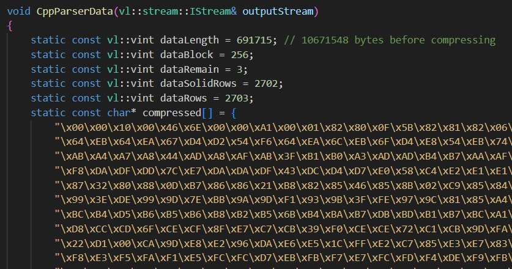

不过`VlppParser`依然遗留了一个问题，为了开发方便，状态机是用正常的定义数据结构的方法写出来的，序列化和反序列化要做的事情都太多了，非常的不cache friendly。`VlppParser2`解决了这个问题。

## if-else歧义的解决方式

if-else歧义说的是一个教科书上的经典案例。当你写下如此语法的时候：

```
IfStat
  ::= "if" Expr:condition "then" Stat:thenBranch ["else" Stat:elseBranch] as IfStat
  ;

Stat:
  ::= !IfStat
  ::= "while" Expr:condition Stat:body as WhileStat;
  ::= ";" as EmptyStat;
  ::= "{" {Stat:stats} "}" as BlockStat;
  ;
```

处理`if X then if Y then ; else ;`就会出问题，因为你无法确定这个`else`是跟着谁的，从而产生歧义。教科书给出的方法简单粗暴，你只要让`"then" Stat:thenBranch`的这个部分不能是一个不带`else`的`if`语句就好了，不过写起来会很麻烦。为什么我要在上面留一个`while`语句，就是为了展示这种情况：

```
IfStat_Complete
  ::= "if" Expr:condition "then" Stat_Complete:thenBranch "else" Stat_Complete:elseBranch as IfStat
  ;

IfStat
  ::= "if" Expr:condition "then" Stat:thenBranch as IfStat
  ::= "if" Expr:condition "then" Stat_Complete:thenBranch "else" Stat:elseBranch as IfStat
  ;

Stat_Shared
  ::= ";" as EmptyStat;
  ::= "{" {Stat:stats} "}" as BlockStat;
  ;

Stat_Complete:
  ::= !IfStat_Complete
  ::= "while" Expr:condition Stat_Complete:body as WhileStat;
  ::= !Stat_Shared
  ;

Stat:
  ::= !IfStat
  ::= "while" Expr:condition Stat:body as WhileStat;
  ::= !Stat_Shared
  ;
```

可以发现基本上每个东西都得两份。如果是面对一个真实的语言，那语法就会变得很乱。而且这不仅仅是写的难看的问题，在匹配的时候，所有的if-else都得被匹配两次，就因为`IfStat`两个分支共享了太多前缀。合并前缀的优化在这里也很难做，毕竟`Stat`和`Stat_Complete`的差别确实很大。

为了让他尽量保持高可维护性和高性能，有两个办法，一个是引入静态开关，另一个是优先级。这两个功能我都做了，不过if-else歧义更适合使用优先级来解决。我们可以给`[]`引入一个语法，如果出现歧义的时候，走`[]`的分支会胜出，如果运行时有嵌套的分支出现，最里面的优先胜出。这种时候我们可以写作`+[]`，那么语法只要这样写就好了：

```
IfStat
  ::= "if" Expr:condition "then" Stat:thenBranch +["else" Stat:elseBranch] as IfStat
  ;

Stat:
  ::= !IfStat
  ::= "while" Expr:condition Stat:body as WhileStat;
  ::= ";" as EmptyStat;
  ::= "{" {Stat:stats} "}" as BlockStat;
  ;
```

一下子就简洁了。

静态开关也有它的作用，比如C++的运算符有十几个优先级，你可以按照四则运算的手法写出一大串语法，结果有一天你突然发现模板参数里面不能用大于号，这下惨了，难道你要把这一大堆再复制一遍，就为了做一个没有大于号的表达式语法？为什么不用模板的手法来解决呢？这就是引入静态开关的重要原因。开关在这里就像模板参数，不过写语法模板只需要`true`和`false`作为参数的值就足够了，所以把它命名为开关。你在引用一个语法的时候，可以给开关赋值，语法内部也会根据开关的值来标记那些愈发的部分会被无效化，开关的值会随着调用链一级一级传播下去。实际产生PDA的时候，编译器就会帮你“把这一大堆再复制一遍”。

## VlppParser实现局部歧义和自动恢复的做法

首先说一下什么是局部歧义。比如下面这个C++函数：

```C++
int main()
{
  A<B>C;
  D<E>F;
  return 0;
}
```

如果你不知道`A`和`D`是什么，那这两行都要么可以解释成表达式或者变量定义。如果你写的parser不想在parsing的过程中就去分析符号到底是什么，那你就需要在最终的语法树里面保留这两种选择。但是这是个组合爆炸，你肯定不希望parser直接给你4棵语法树，而是只告诉你这两个语句都有两种可能。这就是歧义为什么是局部的的意思。而`VlppParser`自然也要支持这一点，那么在运行PDA的过程中，不仅要有分支，你还需要知道什么时候合并，而且合并的还要恰到好处，因为这涉及到AST如何表达歧义。

### @ambiguous

AST是强类型的，自然允许发生歧义的地方也需要在类型里面有所体现。为了简化声明，一个`class`前面可以标记`@ambiguous`，比如说我们的语法允许某些表达式可以有歧义，一个表达式的字符串经过parse出来可以有不同的结果，那么他会给你一个`ExpressionToResolve`，你访问其`candidates`成员就可以得到全部的可能性：

```
@ambiguous class Expression{}
class NumExpr : Expression {...}
class BinaryOpExpr : Expression {...}
```

它就会被翻译成：

```
class Expression{}
class NumExpr : Expression {...}
class BinaryOpExpr : Expression {...}

class ExpressionToResolve : Expression
{
  var candidates : Expression[];
}
```

而如果`Expression`里面有东西，那就还得再加一层：

```
class Expression{}
class ExpressionCommon : Expression {...}
class NumExpr : ExpressionCommon {...}
class BinaryOpExpr : ExpressionCommon {...}

class ExpressionToResolve : Expression
{
  var candidates : Expression[];
}
```

`ExpressionToResolve`的存在也意味着，歧义发生的时候，parser需要准确地在得到`Expression`的语法处分开合并，这样所有的分支就可以被执行并得到一系列的`Expression`对象，然后存到`ExpressionToResolve`里。因为`ExpressionToResolve`也是`Expression`，因此其之前和之后的PDA执行都不会受到影响，好像歧义从来都没发生过一样。

### 一个可以被执行的PDA

上面提到每一个语法生成自己的PDA之后还有“后面还有一系列复杂的处理”，现在以上面提到的四则运算的例子来解释一下。上面的例子只有乘法，现在我们把括号和加减乘除全部包含进去。首先我们会得到`Factor`、`Term`和`Expr`的三个PDA如下：

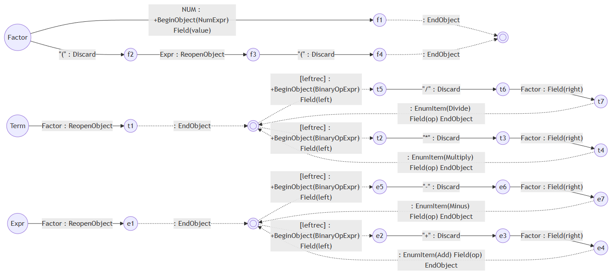

下面这一步就要体现PDA之所以是PDA而不是DFA的意思，因为PDA比DFA多了个堆栈。比如说你走`Expr-->e1`的时候需要接收一个`Term`，`Term-->t1`的时候需要接收一个`Factor`，而`Factor`就要看当前token到底是`NUM`还是`"("`。假设现在就是`NUM`那么要走到`f1`，`f1`后面就没东西了所以会走虚线到双圆圈。双圆圈后面是哪呢？他已经是尽头了，于是就要看到底之前PDA的执行是如何走到`Factor`这一步的。

最简单的方法，就从`Expr`到`f1`的时候往堆栈里放`Expr-->e1`和`Term-->t1`两个transition，那么`Factor`的双圆圈一看，栈顶是`Term-->t1`，所以当无路可走的时候就会把它pop掉（需要执行它的指令）然后走进`t1`。`t1`也是同理，下一步就是双圆圈，但是这个时候双圆圈是有其他选择的，于是就要看下一个token是不是`"*"`或者`"/"`，然后就有`t2`、`t5`和继续pop三个选择。

这里就可以体现出虚线的意思，也就是他不消化任何新的token。而标记`[leftrec]`还有个好处，就是你可以选择在能左递归的时候就不退出。这当然取决于你的语法是不是希望带有这种语义，并不是强制性的，而是给予你继续扩展的灵活性。

于是我们需要把三个PDA都合并起来，所有的rule input就都没有了，全部变成token input再加上transition堆栈的入栈操作。

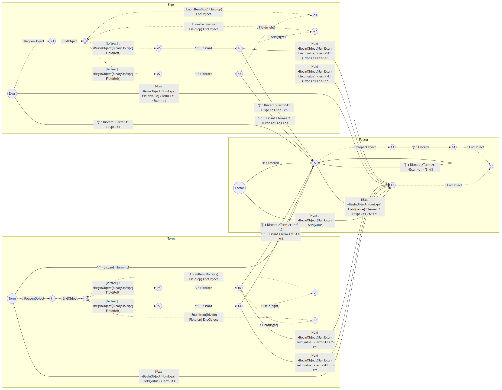

这么复杂的状态机我已经不指望读者真的去看了。一个简简单单的四则运算都能搞出来这么复杂的状态机，更别说JSON、XML、GacUI的Workflow脚本语言、甚至C++了。这就是为什么上面一个C++语法的PDA可以这么大（几千个状态序列化后10M）。

### VlppParser具体的执行手段

在`VlppParser`里面，状态机使用普通手段加载在内存里的，也就是说凡是列表的地方都用容器，不能预先分配好的对象都会用智能指针，这样内存负担就很大。`VlppParser2`解决了这个问题。不过这不是这一节的重点。`VlppParser`追求的是一次parse出结果，于是就有了`ParsingGeneralParser`这么个接口，负责的就是读token跑PDA执行指令。每次读到一条指令就会送到`ParsingTransitionProcessor`接口里，这个接口的实现可以直接构造语法树，或者在单元测试里面还能把他存下来，这里可以用combinator。

根据是否允许歧义以及是否允许错误恢复，`ParsingGeneralParser`有了四个实现，但是因为理念很简单，实现起来竟然非常短。这里说到错误恢复，如果当前token导致状态无法进行转移，那他就会猜一个，这里有一些简单的策略略去不谈。一个不允许歧义的自动恢复策略，他就会优先猜一个最好的token补充进去，除非没有什么好的选择才会跳过当前token。之所以这样，是因为错误恢复一般用来处理打了一半的代码，于是我们总是可以假设出现语法错误的原因是代码没打完。一个允许歧义的自动恢复策略，他就会同时猜好几个，然后再设计另一个策略来在一段时间后比较哪一个（或者多个）猜测更好，只留下这些好的。

不管是否有自动恢复或者歧义，这个实现会在当前状态只有一个可能的时候马上执行指令，这样随着token的读取，Create堆栈和Object堆栈的操作也在同步进行，一直到所有的token都消化完了，如果能顺利走到终点，那么你就得到了parse好的语法树。

### 局限性：无法应对复杂的歧义结构

一切看起来都非常的美好，直到现实需求导致语法越来越复杂，终于到了一个时刻，我看到了非常复杂的歧义分支和合并的结构。简单的解释一下，因为最后的PDA的每一个transition都必须要么消耗一个token要么有特殊的功能。我们看看上面四则运算的例子。在这里我只保留PDA里面`Factor`的部分，这样可以看得更清楚一点。读者们可以跟上面“未处理过”的`Factor`对比一下：

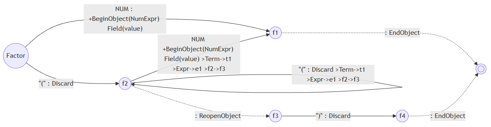

为什么从`f2`可以通过消耗一个`NUM` token到`f1`，是因为这里原本是`( EXPR )`，那么他就会从`EXPR`走一圈，重新回到`Factor`并通过`NUM`抵达`f1`。大家可以从这个transition的细节从看到：

```
NUM

+BeginObject(NumExpr)
Field(value)

>Term->t1
>Expr->e1
>f2->f3
```

如果当前的两个token分别是`NUM`和`")"`，那么他就会依次走到`f1`、`Factor`双圆圈、`t1`、`Term`的双圆圈、`e1`、`Expr`的双圆圈、`f3`。那这条transition的指令是怎么来的呢？实际上就是通过折叠起来的这么多transition它的带`+`的指令全部合在一起（只是恰好`Term`和`Expr`都没有带`+`的指令）。那么就会出现一种情况，这条边会有若干个`BeginObject`，还会有一些别的。

如果没有`!`的话，每一个`BeginObject`都会对应一个`EndObject`。如果出现了`!`，则每一个`BeginObject`在`EndObject`之后还会被重复`ReopenObject + EndObject`若干次。所以一个`BeginObject`最终会有一个位置最推迟的`EndObject`。

在出现歧义的时候，就会有一些非常麻烦的情况发生。比如分支是在`BeginObject`之后很远才发生的，在分裂出来的几条分支里各有各自的`EndObject`。甚至随着分支被不断的合并，若干个在不同位置被合并的`EndObject`对应的`BeginObject`甚至都出现在第一次分支之前的transition，或者干脆就在同一个transition里面。`BeginObject`分裂出来的好几个`EndObject`也不一定会同时合并，而不同的嵌套`BeginObject`分裂出来的分支则可能在同一个（也就是第一个发生歧义的）`BeginObject`对应的`EndObject`处合并在一起。甚至还有一些非常诡异的情况，有些分支走了左递归，有些分支不走左递归，导致一个分支是`BeginObject - BeginObject - EndObject - Field - EndObject`,而另一个分支是`BeginObject - EndObject - BeginObject - Field - EndObject`，他们的指令嵌套结构甚至不一样。

歧义表达在PDA执行过程中的结构实在是太复杂了，远远超出了“一边跑PDA一边出AST”所能处理的范围。那这两个事情肯定有一个是错的。到底是复杂的歧义结构不应该出现呢，还是“一边跑PDA一边出AST”行不通呢？

如果不要复杂的歧义结构，除了指令的设计要改以外，你还不能在合并后的PDA上面跑。改指令问题不大，关键是如果PDA不合并而是分开运行的话，那跑一个复杂的输入所需要执行的transition数量可能会翻个几十倍，这对性能可是一个巨大的破坏。这是万万不能的。因此答案必须是“一边跑PDA一边出AST”行不通。

有了这个结论就好办了，既然这个方法是错误的，而且`VlppParser`的PDA数据结构确实非常不cache friendly，那就重做吧！于是我开了一个新的项目，那就是[VlppParser2](https://github.com/vczh-libraries/VlppParser2)。此时[vczh-libraries/GacUI](https://github.com/vczh-libraries/GacUI)已经大量依赖`VlppParser2`，我重写的时候需要保证它生成的parser代码的外观尽量跟`VlppParser`相似，然后把所有的依赖都重新整一边，还花了一点时间。

## 手写C++编译器前端

在开始`VlppParser2`之前，我曾经为`GacUI`做了一个[文档生成工具](https://github.com/vczh-libraries/Document/tree/release-1.0)，因此我尝试用`VlppParser`写一个C++ parser，发现根本写不出来（原因如上），于是干脆从零开始做，顺便实践一下一遍语法分析一边符号处理的方法，这样可以在遇到歧义的时候马上查符号表来确定正确的分支。这个项目的[实际效果](../../CppVisualize.html)被我单独保存了起来，你甚至可以[查看每一个文件](../../CppVisualize/Gaclib/SourceFiles/GuiApplication.h.html)，上面的符号都是带了超链接的。超链接的结果就是通过符号表算出来的，它甚至考虑了重载和模板偏特化造成的影响。

这个项目非常的难，主要是C++的内容真的是太多了，而且当时的进度连C++14都没支持完。而灾难发生在一次Visual Studio的升级里。我从2017升级到2019之后发现msvc带了好多新的不能容忍的bug，导致我的单元测试整个没用了。我为了确保我对C++代码的处理结果和msvc保持一致，我用了一些很fancy的写法，给一段代码作为上下文，然后我可以问msvc说这个符号是什么，然后我自己算一遍，最后比较一下两边类型是否一致。我用这个手法写了海量单元测试，结果新的msvc bug导致我的这种符合标准的做法报废了，我私底下给他们开了很多bug，从新冠发生之前到现在都没修完。

单元测试不能跑，那这个项目就没用了。不过这确实让我意识到一个问题，因为我不可能做出真正的100%完整的C++编译器，就算我能我也不想陪着C++标准跑步，这根本不可能靠一个人的力量完成。因此我总会在一些奇怪的地方处理不了符号，这直接导致parsing出现中断。于是我就在想，其实我根本就不应该在parsing的时候处理所有歧义，我干脆把歧义保留下来，AST到手之后我能做多少就做多少。

因此重写`VlppParser`的一个目标，就是让他具备处理C++语法的能力。现在看来`VlppParser2`完全具备这个能力，因为[生成的C++ parser](https://github.com/vczh-libraries/VlppParser2/tree/master/Test/Source/BuiltIn-Cpp/Syntax)已经[跑起来了](https://github.com/vczh-libraries/VlppParser2/tree/master/Test/UnitTest/BuiltInTest_Cpp)。当然目前还有一些性能问题、潜在的可以消除的歧义和C++20开始的一些新语法没做进去，但是目前没看到什么是不能做的。

## VlppParser2诞生！

新的实现全面采用cache friendly的手法来储存。不管是状态机还是parsing的中间产物一律避免直接的堆操作，转而用自己的内存池来维护。内存池其实就是给每个类型都放一个`vl::collections::List`，然后跨类型的引用就全部用一个`vint32_t`来代替。虽然手法非常简单粗暴，但是由于每个对象都很小，节省成千上万的堆操作（处理长一点的代码我看可能可以到几万个）让性能有了巨大的提升。序列化和反序列化也变得很快，以前debug模式还要等个一秒钟让Workflow状态机加载，现在基本感觉不到。

如果说上面的只是优化，那`Trace`的引入则是重写的根本目的。上面讨论过`ParsingGeneralParser`的四个实现，在这里全部没有了（虽然实际上错误恢复还没做，不过不影响结构的设计），因为有太多的语法，就算本身没有歧义，执行的过程也是避免不了歧义的发生的，因此`Trace`做的事就是把parsing的过程全部都记录下来。现在parse完了不会直接给你构造语法树的指令，而是给你一个偏序关系的`Trace`，代表了所有成功的执行路径。每一个`Trace`记录的就是一次状态的转换。`Trace`也使用相同的结构保存起来的，所以整个parsing的过程中也只产生几块连续的内存，而且执行的过程中大概率只会访问每块连续内存最靠后面的那一点点，非常的cache friendly。

而输入是否合法的判断也变得很简单，如果在读完最后一个token的时候，有且只有`Trace`抵达了终点，那么就算他成功了。可以进行后续的步骤产生AST。

于是上面“局限性：无法应对复杂的歧义结构”这一节的问题都不存在了。现在摆在你眼前的是整个parsing的历史，parse完之后可以反复回味。

### 第一步：构造Trace的双向偏序图

首先parsing的过程中会引入很多失败的`Trace`，不过每个`Trace`还是会记录的上一个`Trace`是谁。尽管有些`Trace`会走向覆灭，但是对于成功的`Trace`来说，它的“上一个”肯定都是合法的。因此从最后一个`Trace`开始往前看，最后生成一个数据结构，维护双向的偏序图。

这一步会顺便查看parsing的过程中是否引发了歧义，如果没有的话（也就是`Trace`会退化成一个双向链表），那么会直接跳过所有步骤，直接生成一个`ExecutionStep`包含整个`Trace`链表，然后宣告结束。`ExecutionStep`的具体内容后面会提到。

每一个`Trace`可能会有若干个分支，但是PDA的设计保证了`Trace`之间不会出现多对多的情况，也就是一个`Trace`，可能有多个分支从它这里出来，也可能会有多个分支到它这里结束，这两件事也许会同时发生，但是不会出现一边分裂一边合并的情况。

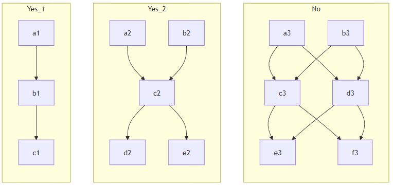

于是我设计了一个数据结构来表达这种情况：

```C++
struct TraceCollection
{
	Ref<Trace>					first;						// first trace in the collection
	Ref<Trace>					last;						// last trace in the collection
	Ref<Trace>					siblingPrev;				// previous trace in the collection of the owned trace
	Ref<Trace>					siblingNext;				// next trace in the collection of the owned trace
};

struct Trace : Allocatable<Trace>
{
	TraceCollection			predecessors;				// ids of predecessor Tra
	TraceCollection			successors;					// ids of successor Trace
};
```

一个`Trace`的`predecessors.first`和`predecessors.last`分别代表了上游所有`Trace`的第一个和最后一个，这些`Trace`的`predecessors.siblingPrev`和`predecessors.siblingNext`则构成了一个链表，把所有的`Trace`串了起来。如果上图中的非法情形不发生，那么一个`Trace`就不会同时是多个上游`Trace`分裂的产物（之可能来源于多个上游，但是每个这样的`Trace`都只有一个下游）。也就是说，如果把每一个**含有多个元素**的`predecessors`视为一个容器，那每一个`Trace`只会出现在一个容器里，也就是只要他自己的`predecessors.siblingPrev`和`predecessors.siblingNext`只要不为空，那么这同时说明了三件事：
- 本`Trace`会跟其他`Trace`合并到唯一的下游
- 本`Trace`的下游的所有上游的`predecessors.siblingPrev`和`predecessors.siblingNext`跟下游`Trace`的`predecessors.first`和`predecessors.last`共同构成了一个完整的双向链表。

`successors`同理。

### 第二步：对Trace上的指令做partial execution

<!--
- VlppParser2
  - 新的状态机存储方式
	- Trace的存储方式
  - 重新设计了歧义的实现，通过multiple passes取代上一代读一次就出结果的executor设计
    - Input / PrepareTraceRoute / ResolveAmbiguity
    - Trace / TraceAmbiguity / ExecutionStep
- reuse/partial rule产生的新指令：DelayFieldAssignment
- 合并前缀（三个情况）
  - 前缀合并可以让Workflow跑一个长代码从11万trace缩小到6千
  - 相同指令前缀合并
  - 不同指令相同rule前缀合并
  - 不同rule但是调用进去遇到相同的rule的前缀合并
    - left_recursion_inject, left_recursion_inject_multiple
    - prefix_merge语法重写
    - LriStore/LriFetch
- 为什么这个终极补丁对前缀合并产生了困难
- 此次重构如何解决这个问题
  - 重新设计指令
    - 把(DFA/)?BO/EO固化为SB/CO/SE
    - 把(DFA/)?RO/EO固化为SB/SE
    - 利用StackSlot把Field都移动到SE前面
  - 新的指令如何让合并前缀变得更顺利处理的情况更多（三个情况）
  - 重做multiple passes的歧义处理
    - PrepareTraceRoute从产生object改为产生stack，也就是追踪的是每一个SB/SE的结果，而不是具体的对象（因为对象可能被多个SB/SE共享）
    - ResolveAmbiguity的BuildExecutionOrder重做

copilot翻译成英语
- 原文复制到en_us.md
- 抽出所有标题和段落，生成task list，写进en_us_todo.md
- 一边翻译一边标记todo一边生成词汇表vocabulary.md
- 翻译的结果保存金en_us_translation.md，标题重写，翻译的时候一段中文注释一段英语
- 结束后重新复制回en_us.md
- git对比一下翻译是否完整
-->
