# 记录GLR Parser的重构，论打补丁和技术债的恶性循环

> 做到这已经非常累了，正常来说早就要审视一下过去的设计是不是有问题了。不过实际情况是，从文章的开头走到这已经花了10年，这个项目一开始很简单，就是GacUI当初需要JSON和XML的时候，觉得以后反正还有很多parser要写，不如干脆做个GLR parser gen。后面随着feature的加入越来越复杂，每隔一两年就做一点修改，完全忘记了上一次打补丁的情绪和感受。而且前面每一个补丁规模都很小，有些甚至只需要修改语法的编译器而不需要改动到PDA的设计，就算是改动了也只不过是小修小补，自己经常意识不到自己在打补丁，令人麻痹大意，温水煮青蛙也。一路走过来，我们破坏了很多原本引入的抽象，每一个补丁都逐渐依赖抽象背后的实现，实际上就是在实践[依赖巧合编程](https://en.wikipedia.org/wiki/Programming_by_permutation)。没有在需要重构的时候马上动手，就会有越来越多的代码依赖错误的设计，总有一天会改不动。这个时候要么你真的特别牛逼把重构做出来，要么重写，要么就[干脆放弃](https://en.wikipedia.org/wiki/The_Mythical_Man-Month)。
>
> 不过换个角度，如今的资本主义社会令码农并不能在法律上产生对代码的ownership，其实你写的都是别人的东西，到底要不要容忍[错误的实践](https://en.wikipedia.org/wiki/List_of_software_anti-patterns)，其实也见仁见智了。不过是否执行好的实践，最好只是你的一个选择，而不是受限于你的能力。所以下班后折腾自己的项目，亲自体验这些东西，我认为都是很有必要的。特别是LLM时代AI把屎一车一车的运到屎山上喷，如果你不具备这种能力，项目可能在你可以离职前就已经光速崩掉了，那这就不好办了。就算你上班用不上AI，下班后用AI喷屎然后自己铲干净，也是一种练习。

此刻正是2025的圣诞节。项目的起源还得从许久以前说起。回顾这一路走来的过程，先是中学的时候为了开发游戏制作第一个游戏引擎随后对编译原理产生了兴趣；接着就是在大学时期先后实现了垃圾收集器、C语言子集一路做到汇编器、和一个Haskell子集的类型推导；毕业后又借机把type class加到了C语言上面。

这个过程没有光做编译器，还是图给所有的这些东西做编辑器，包括上下文有关着色和自动完成等一系列IDE的标准功能都是用C#做的。编译器是C++写的但是编辑器是C#写的，于是我从parser到类型推导都分别用C++和C#各做了一遍，这怎么想都是不对的。


不过这其实才是现实世界里大家的普遍原则。想想当时地球上爆火的几款代码编辑器，分别有正在（已经）用C#和XAML重写的Visual Studio、用Jvav写的Eclipse、用Jvav写的一系列不同语言的IDE、还有马上就要诞生的TypeScript写的vscode。它们哪个不是一个语言的前端做了好几遍？要么就是编译器和编辑器是不同地方的人做的，要么语言本身就没有自举，或者自举了但完全没考虑过编辑器的需要。比如微软明明用C++写了编译器和VS，但是VS用的却是Edison Design Group实现的C++前端；比如原本用C++写的C#编译器后面用C#重写了（Roslyn）；比如原本用JS写的TS然后换TS又写了一遍然后换go又写了一遍；似乎分开做才是业界常态。

但我自己做又没有类似的问题，于是怀揣着编译器和编辑器共享一套编译器前端的想法，就有了[vczh-libraries/GacUI](https://github.com/vczh-libraries/GacUI)，以及为了实现语法分析和给语义着色和自动完成打基础的VlppParser和VlppParser2（整个重写过）。故事便从[VlppParser](https://github.com/vczh-libraries/VlppParser)和[VlppParser2](https://github.com/vczh-libraries/VlppParser2)这里发生。此时正是大学刚毕业的时候，所以VlppParser的设计还能看见当初在大学的时候诞生的很多想法。

## 一个JSON parser

Parser是怎么运行起来的呢？阅读[JSON的官网](https://www.json.org/json-en.html)我们可以迅速写出它的[词法和语法](https://en.wikipedia.org/wiki/Extended_Backus%E2%80%93Naur_form)：

```
TRUE_VALUE:true
FALSE_VALUE:false
NULL_VALUE:null
OBJOPEN:\{
OBJCLOSE:\}
ARROPEN:\[
ARRCLOSE:\]
COMMA:,
COLON::
NUMBER:[\-]?\d+(.\d+)?([eE][+\-]?\d+)?
STRING:"([^\\"]|\\[^u]|\\u\d{4})*"
discard SPACE:\s+
```

[VlppRegex](https://github.com/vczh-libraries/VlppRegex)会处理这些正则表达式，然后把它们合并成一个[DFA](https://en.wikipedia.org/wiki/Deterministic_finite_automaton)。合并DFA的好处就是可以让你一个一个字符跑到token结束的时候正好知道他命中了上面的哪一行。

如果一个正则表达式已经封装好了，就很难做出这样的功能,所以当初就自己做了一个。以前用C#还是TypeScript写类似的东西，就真的一个一个正则表达式去试。正则表达式会有很多超出DFA表达能力的功能，所以这里面其实有两套实现，如果发现能用DFA那就走DFA，不能的就走另一套。但是词法分析器是不允许使用那些高级功能的，因此可以在每个正则表达式生成DFA之后继续往下做。

这个时候JSON字符串已经变成一个一个的token，而且每个token还标记出了它的名字，那么就可以跑语法了。语法里面的`@parser`标记是为了辅助生成C++代码用的，标记了`@parser`的语法都会生成几个helper，把背后的东西都打包在一起。

```
JLiteral
  ::= STRING
  ::= NUMBER
  ::= "true"
  ::= "false"
  ::= "null"
  ;

JField
  ::= STRING ":" JValue
  ;

JObject
  ::= "{" {JField ; ","} "}"
  ;

JArray
  ::= "[" {JValue ; ","} "]"
  ;

JValue
  ::= JLiteral
  ::= JObject
  ::= JArray
  ;

@parser JRoot
  ::= JObject
  ::= JArray
  ;
```

以`JObject`为例，我们可以直接生成他的[epsilon-NFA](https://en.wikipedia.org/wiki/Nondeterministic_finite_automaton)。其中`{a ; b}`是一个缩写，展开后会变成`[a {b a}]`，但是生成PDA的时候是直接处理的，这样就免去了重复计算：


然后还是当他正则表达式那样做，把rule input和token input都先当成不一样的原子输入看，生成它的DFA。当然这并不是真的DFA，他是一个[PDA](https://en.wikipedia.org/wiki/Pushdown_automaton)，因为rule之间或者rule/token之间是会存在包含关系或者共享前缀的，但是先不管，后面自有办法：


后面还有一系列复杂的处理，但总之我们还是得到了一个能跑的东西了。于是给一个JSON字符串，现在我们可以验证他是不是一个合法的JSON了，从`JROOT`开始运行，如果把所有token都吃掉的同时正好跑到状态机的最后一个状态，就说明成功了。费了这么大劲就搞出这么个东西？当然不是，我们的目标是生成JSON的语法树。

### 语法的副作用

既然要生成语法树，那就得继续往语法上加信息。经过短暂地思考，就可以知道一行语法大概需要做的事情有：
- 构造语法树的一个对象，比如`JObject`
- 把别人的语法树拿过来，比如`JValue ::= JObject`，这样`JValue`可能会生成好几个不同的东西
- 不仅要把语法树拿过来，还要对他继续做修改，这个在JSON里暂时还不存在，后面会提到

此时语法的表达就不是特别的简洁了，慢慢罗嗦起来，但是至少为了[写上最必要的信息](https://github.com/vczh-libraries/VlppParser2/blob/master/Source/Json/Syntax/Syntax.txt)，我们还是得到了

```
...

JObject
  ::= "{" {JField:fields ; ","} "}" as Object
  ;

...

@parser JRoot
  ::= !JObject
  ::= !JArray
  ;
```

为了解释加进去的信息的意思，我们还需要定义[JSON语法树的结构](https://github.com/vczh-libraries/VlppParser2/blob/master/Source/Json/Syntax/Ast.txt)：

```
class Node
{
}

...

class Object : Node
{
  var fields : ObjectField[];
}
```

最后只要把这些信息都加入到上面生成的PDA就可以了。一个很自然的想法就是，既然parse一个JSON无非就是从`JROOT`的状态机开始跑到完，那只要一边跑一边构造语法树就行了。从一个状态到另一个状态转移（transition）的时候，我们需要看下一个token是什么，从这个状态出发的那么多transition里选中我们想要的，顺便就可以做点事。

“做点事”到底做什么事呢？现在我们已经从上面的语法树的定义[生成了它的C++代码](https://github.com/vczh-libraries/VlppParser2/blob/master/Source/Json/Generated/JsonAst.h)，那就先来看看，假如我们需要生成`{"a": "b"}`的语法树，我们需要做什么：

```C++
auto obj = Ptr(new JsonObject);
{
  auto field = Ptr(new JsonField);
  field->name.value = L"a";
  {
    auto value = Ptr(new JsonString);
    value->content.value = L"b";
    field->value = value;
  }
  obj->fields.Add(field);
}
```

pattern一下就看出来了。一个很自然的想法就是，我们可以设计一个指令集，就专门用来生成语法树。每一个transition带了一些指令，而运行指令就等于运行一些特定的函数，而这些函数就可以从语法树的定义里生成出来。那首先我们要补齐读token的动作：

```C++
auto obj = Ptr(new JsonObject);
{
  NextToken();                         // {这个token是不要的，但是又必须把他读掉
  auto field = Ptr(new JsonField);
  {
    auto token = NextToken();          // "a"
    field->name = token;
  }
  NextToken();                         // :
  {
    auto str = Ptr(new JsonString);
    {
      auto token = NextToken();        // "b"
      str->content = token;
    }
    field->value = str;
  }
  obj->fields.Add(field);
  NextToken();                         // "}"
}
```

然后令他变得抽象：

```
BeginObject(Object)
  Token                  // {
  Discard
  BeginObject(Field)
    Token                // "a"
    Field(name)
    Token                // :
    Discard
    BeginObject(String)
      Token              // "b"
      Field(content)
    EndObject
    Field(value)
  EndObject
  Field(fields)
  Token                  // }
  Discard
EndObject
```

一切看起来都很美好，指令跟C++代码简单的对应起来了，实现它应该不费吹灰之力。我们不妨把它称之为“BeginObject指令集”。

### 实现BeginObject指令集

指令集的表达是独立的，但是具体构造的类型又是生成的代码，所以中间需要一些设计模式的支持，这些对各位来说应该跟喝水一样简单了。但是我们还是可以讨论一下这些指令到底干了什么。`BeginObject`是嵌套的，所以它需要一个堆栈。Field就可以从堆栈里拿东西出来，写到成员变量里面去。但是我们怎么知道栈顶的对象到底经历了`EndObject`没有呢？这个好说，干脆把堆栈一分为二，`EndObject`就可以从堆栈1把东西pop出来push到堆栈2，`Token`可以把token也压到堆栈2，那么`Field`就可以从堆栈2把对象pop进成员变量了。我们不妨把他们命名为`Create堆栈`和`Object堆栈`：

```
BeginObject(type) = { cs.Push(Create(type)); }
Token = { os.Push(NextToken()); }
Discard = { os.Pop(); }
Field(field) = { cs.Top().SetField(field, os.Pop()); }
EndObject = { os.Push(cs.Pop()); }
```

于是我们就可以把这些指令都加到上面的PDA的transition里面去。需要注意的是，带`+`的指令说明它是在transition真正做出动作之前（比如`NextToken()`，比如进入`JField`对应的另一个PDA里）执行的：


最后我们把`{"a": "b"}`送进`JRoot`，一顿分析，最后一看Create堆栈（cs）是空的，Object堆栈（os）剩下一个对象，好的！我们的语法树完成了。

等等！还记得我们的`JRoot`吗？

```
@parser JRoot
  ::= !JObject
  ::= !JArray
  ;
```

这个“直接把东西拿来用”的`!`又要怎么表达呢？回顾一下上面说的，一行语法要做的事情有三件：
- 构造语法树的一个对象，比如`JObject`
- 把别人的语法树拿过来，比如`JValue ::= JObject`，这样`JValue`可能会生成好几个不同的东西
- 不仅要把语法树拿过来，还要对他继续做修改，这个在JSON里暂时还不存在，后面会提到

我们可以把2和3做在一起，`JRoot`看到`!JObject`就把已经在Object堆栈里面的`JObject`重新放回Create堆栈里，再进行一顿修改之后放回去就好，因此我们只需要加入一个新的指令：

```
ReopenObject = { cs.Push(os.Pop()); }
```

因为`JRoot ::= !JObject`，所以JRoot不能有自己的BeginObject指令了。下面的BeginObject(JObject)...EndObject是属于`JField`的：

```
// JRoot没有BeginObject
  BeginObject(JObject)
    ...
  EndObject
  ReopenObject
EndObject
```

此时的味道已经不太好了，感觉就像给指令集打了个补丁，不过因为这个补丁实在是太过于直接而且合理，而且`EndObject`和`ReopenObject`互为逆操作的这件事让我莫名感到快乐，就像是推导出了理所当然的结构一样，当时并没有想到以后会造成那么多问题，补丁一个一个像滚雪球一样堆上去，直到不得不推翻重来两遍。但是我们先不管，先来看看`JRoot`的PDA：


## 四则运算与左递归

一样是循环，上面生成的AST是数组，但是如果我们想递归怎么办？考虑一个二元运算符的例子，比如说乘法。假如他是右结合或者左结合，分别会有两种写法：

```
Factor
  ::= NUM:value as NumExpr
  ;

TermR
  ::= !Factor
  ::= Factor:left "*" TermR:right as MulExpr
  ;

TermL
  ::= !Factor
  ::= TermL:left "*" Factor:right as MulExpr
  ;
```

TermR和TermL的PDA分别如下：


对于右递归，有一个明显的优化问题摆在眼前，就是`TermR`出来有两个分支都是`Factor`，必须把它合并。但是由于他们各自的指令不同，合并了有会有一些其他问题。而且由于[GLR parser](https://en.wikipedia.org/wiki/GLR_parser)的特点，就算不管他也不会影响正确性，只是会浪费点时间parse两次`Factor`然后丢掉其中一个。所以一开始我并没有管，而且它会被一个更大的更麻烦的问题所包含。这个部分会在文章靠后的地方找到。

对于左递归，显然这并不是一个优化问题。输入是`1`的时候走上分支，输入是`1*2`的时候走下分支，输入是`1*2*3`的时候要走下分支两次。但是仔细想想就会发现，走下分支就马上回到自己，然后你必须要立刻做出选择，这相当于你需要预测后面有多少`*`，显然是不可能的。我们只能化递归为循环。如果我们在语法上做循环，会发现做不出来想要的左结合的语法树，因此我们在PDA上想办法。

要化为循环，就需要确定循环的开始和结束，而这很明显是要做出`Factor {"*" Factor}`的效果。因此不管是第一个分支的`Factor`结束或者是第二个分支的`Factor`结束他都要回到`"*"`，于是我们可以在PDA上把这两个transition做出来，同时就要断开所有左递归语法的第一个输入：


这个新出来的transition的指令应该填什么呢？显然再也不可能把`1*2`的`BeginObject(MulExpr)`放在`1`的外面了，否则你就要面临“到底需要提前放几个`BeginObject(MulExpr)`的问题”，问题等于没解决。所以在执行指令的时候，`1`只能放在`BeginObject(MulExpr)`的前面，而且接下来的`Field(left)`还得读到`1`产生的。不过我们马上就能发现：

```
BeginObject(MulExpr)
  BeginObject(NumExpr) ... EndObject
  Field(left)
```

和

```
BeginObject(NumExpr) ... EndObject
BeginObject(MulExpr)
  Field(left)
```

的效果竟然是一样的，因为按照前面的伪代码展开，我们会得到

```
cs.Push(Create(type));
os.Push(NumExpr from "1");
cs.Top().SetField(MulExpr::left, os.Pop());
```

和

```
os.Push(NumExpr from "1");
cs.Push(Create(type));
cs.Top().SetField(MulExpr::left, os.Pop());
```

这意味着我们只需要原封不动地复制原来`TermL`到`2`的transition的指令集就好了，于是我们得到了：


### 状态机的尺寸

大家可能会注意到，一个语法有多少行，虚线就会被复制多少次。不过这其实不是个问题，因为每一行语法生成PDA之后，最后还要背合并成一个大的，transition会只剩下token和虚线。那rule去哪了呢？当然是折叠起来了。比如说从`TermL`到`NUM`要经过`Factor->NUM`，那这两个transition会被合并到一起。这个时候`TermL`和`Factor`就会被push到一个return堆栈里，不然虚线走到结束的时候你怎么知道回到哪呢？这就是PDA比起DFA复杂的地方。到这一步各种transition就会被疯狂复制，状态机会变得很大，你已经不在乎多复制的那几条虚线了。

不过状态机太大，保存就会出问题。为了使用方便，这个项目提供了一个编译器，可以帮你把一系列文法文件（[VlppParser](https://github.com/vczh-libraries/VlppParser)把AST, Lexer, Syntax都写在一个文件了，而[VlppParser2](https://github.com/vczh-libraries/VlppParser2)可以让你分开写一大堆小文件）编译成几个cpp文件，而状态机就序列化到了其中一个cpp文件的字符串里面去。

`VlppParser2`的测试程序里有一个C++的语法，他生成了超过10M的状态机，但是每一个字符都表达为`\xXX`的形式的话他就要40M，这显然是不行的。所以我做了一个[LZW压缩算法](https://en.wikipedia.org/wiki/Lempel%E2%80%93Ziv%E2%80%93Welch)。这个算法真的设计得非常精妙，首先他不用保存字典，因为你压缩和解压的过程中都能做出来同一个字典。其次实现也很简单，我都不用怎么调试，基本就一次成型了。后面在各种地方使用他也没发现过问题。

当然压缩后你的cpp依然会因为`\xXX`而膨涨四倍，这个我就没办法了。C++23实现了[\#embed](https://en.cppreference.com/w/c/preprocessor/embed)预处理操作，可以让你在一个字符串里引入二进制文件的内容。可惜我的项目只开到了C++20，只能以后再实现。

不得不说Lzw的性能真是好，10M的状态机压缩到剩下0.7M，[这个压缩比](https://github.com/vczh-libraries/VlppParser2/blob/master/Test/Source/BuiltIn-Cpp/Generated/CppParser.cpp)真的是非常厉害了。


不过`VlppParser`依然遗留了一个问题，为了开发方便，状态机是用正常的定义数据结构的方法写出来的，序列化和反序列化要做的事情都太多了，非常的不cache friendly。`VlppParser2`解决了这个问题。

## if-else歧义的解决方式

if-else歧义说的是一个教科书上的经典案例。当你写下如此语法的时候：

```
IfStat
  ::= "if" Expr:condition "then" Stat:thenBranch ["else" Stat:elseBranch] as IfStat
  ;

Stat:
  ::= !IfStat
  ::= "while" Expr:condition Stat:body as WhileStat;
  ::= ";" as EmptyStat;
  ::= "{" {Stat:stats} "}" as BlockStat;
  ;
```

处理`if X then if Y then ; else ;`就会出问题，因为你无法确定这个`else`是跟着谁的，从而产生歧义。教科书给出的方法简单粗暴，你只要让`"then" Stat:thenBranch`的这个部分不能是一个不带`else`的`if`语句就好了，不过写起来会很麻烦。为什么我要在上面留一个`while`语句，就是为了展示这种情况：

```
IfStat_Complete
  ::= "if" Expr:condition "then" Stat_Complete:thenBranch "else" Stat_Complete:elseBranch as IfStat
  ;

IfStat
  ::= "if" Expr:condition "then" Stat:thenBranch as IfStat
  ::= "if" Expr:condition "then" Stat_Complete:thenBranch "else" Stat:elseBranch as IfStat
  ;

Stat_Shared
  ::= ";" as EmptyStat;
  ::= "{" {Stat:stats} "}" as BlockStat;
  ;

Stat_Complete:
  ::= !IfStat_Complete
  ::= "while" Expr:condition Stat_Complete:body as WhileStat;
  ::= !Stat_Shared
  ;

Stat:
  ::= !IfStat
  ::= "while" Expr:condition Stat:body as WhileStat;
  ::= !Stat_Shared
  ;
```

可以发现基本上每个东西都得写两份。如果是面对一个真实的语言，那语法就会变得很乱。而且这不仅仅是写的难看的问题，在匹配的时候，所有的if-else都得被匹配两次，就因为`IfStat`两个分支共享了太多前缀。合并前缀的优化在这里也很难做，毕竟`Stat`和`Stat_Complete`的差别确实很大。

为了让他尽量保持高可维护性和高性能，有两个办法，一个是引入静态开关，另一个是优先级。这两个功能我都做了，不过if-else歧义更适合使用优先级来解决。我们可以给`[]`引入一个语法，如果出现歧义的时候，走`[]`的分支会胜出，如果运行时有嵌套的分支出现，最里面的优先胜出。这种时候我们可以写作`+[]`，那么语法只要这样写就好了：

```
IfStat
  ::= "if" Expr:condition "then" Stat:thenBranch +["else" Stat:elseBranch] as IfStat
  ;

Stat:
  ::= !IfStat
  ::= "while" Expr:condition Stat:body as WhileStat;
  ::= ";" as EmptyStat;
  ::= "{" {Stat:stats} "}" as BlockStat;
  ;
```

一下子就简洁了。

静态开关也有它的作用，比如C++的运算符有十几个优先级，你可以按照四则运算的手法写出一大串语法，结果有一天你突然发现模板参数里面不能用大于号，这下惨了，难道你要把这一大堆再复制一遍，就为了做一个没有大于号的表达式语法？为什么不用模板的手法来解决呢？这就是引入静态开关的重要原因。开关在这里就像模板参数，不过写语法模板只需要`true`和`false`作为参数的值就足够了，所以把它命名为开关。你在引用一个语法的时候，可以给开关赋值，语法内部也会根据开关的值来标记语法的哪些部分会被无效化，开关的值会随着调用链一级一级传播下去。实际产生PDA的时候，编译器就会帮你“把这一大堆再复制一遍”。

## VlppParser实现局部歧义和自动恢复的做法

首先说一下什么是局部歧义。比如下面这个C++函数：

```C++
int main()
{
  A<B>C;
  D<E>F;
  return 0;
}
```

如果你不知道`A`和`D`是什么，那这两行都要么可以解释成表达式或者变量定义。如果你写的parser不想在parsing的过程中就去分析符号到底是什么，那你就需要在最终的语法树里面保留这两种选择。但是这是个组合爆炸，你肯定不希望parser直接给你4棵语法树，而是只告诉你这两个语句都有两种可能。这就是歧义为什么是局部的的意思。而`VlppParser`自然也要支持这一点，那么在运行PDA的过程中，不仅要有分支，你还需要知道什么时候合并，而且合并的还要恰到好处，因为这涉及到AST如何表达歧义。

### @ambiguous

AST是强类型的，自然允许发生歧义的地方也需要在类型里面有所体现。为了简化声明，一个`class`前面可以标记`@ambiguous`，比如说我们的语法允许某些表达式可以有歧义，一个表达式的字符串经过parse出来可以有不同的结果，那么他会给你一个`ExpressionToResolve`，你访问其`candidates`成员就可以得到全部的可能性：

```
@ambiguous class Expression{}
class NumExpr : Expression {...}
class BinaryOpExpr : Expression {...}
```

它就会被翻译成：

```
class Expression{}
class NumExpr : Expression {...}
class BinaryOpExpr : Expression {...}

class ExpressionToResolve : Expression
{
  var candidates : Expression[];
}
```

而如果`Expression`里面有东西，那就还得再加一层：

```
class Expression{}
class ExpressionCommon : Expression {...}
class NumExpr : ExpressionCommon {...}
class BinaryOpExpr : ExpressionCommon {...}

class ExpressionToResolve : Expression
{
  var candidates : Expression[];
}
```

`ExpressionToResolve`的存在也意味着，歧义发生的时候，parser需要准确地在得到`Expression`的语法处分开合并，这样所有的分支就可以被执行并得到一系列的`Expression`对象，然后存到`ExpressionToResolve`里。因为`ExpressionToResolve`也是`Expression`，因此其之前和之后的PDA执行都不会受到影响，好像歧义从来都没发生过一样。

### 一个可以被执行的PDA

上面提到每一个语法生成自己的PDA之后还有“后面还有一系列复杂的处理”，现在以上面提到的四则运算的例子来解释一下。上面的例子只有乘法，现在我们把括号和加减乘除全部包含进去。首先我们会得到`Factor`、`Term`和`Expr`的三个PDA如下：


下面这一步就要体现PDA之所以是PDA而不是DFA的意思，因为PDA比DFA多了个堆栈。比如说你走`Expr-->e1`的时候需要接收一个`Term`，`Term-->t1`的时候需要接收一个`Factor`，而`Factor`就要看当前token到底是`NUM`还是`"("`。假设现在就读到了`NUM`，那么要走到`f1`，`f1`后面就没东西了，所以会走虚线到双圆圈。双圆圈后面是哪呢？他已经是尽头了，于是就要看到底之前PDA的执行是如何走到`Factor`这一步的。

最简单的方法，就从`Expr`到`f1`的时候往堆栈里放`Expr-->e1`和`Term-->t1`两个transition，那么`Factor`的双圆圈一看，栈顶是`Term-->t1`，所以当无路可走的时候就会把它pop掉（需要执行它的指令）然后走进`t1`。`t1`也是同理，下一步就是双圆圈。但这一步其实算是有其他选择的，于是就要看下一个token是不是`"*"`或者`"/"`，然后就有`t2`、`t5`和继续pop三个选择。

这里就可以体现出虚线的意思，也就是他不消化任何新的token。而标记`[leftrec]`还有个好处，就是你可以选择在能左递归的时候就不退出。这当然取决于你的语法是不是希望带有这种语义，并不是强制性的，而是给予你继续扩展的灵活性。

于是我们需要把三个PDA都合并起来，所有的rule input就都没有了，全部变成token input再加上transition堆栈的入栈操作。


这么复杂的状态机我已经不指望读者真的去看了。一个简简单单的四则运算都能搞出来这么复杂的状态机，更别说JSON、XML、GacUI的Workflow脚本语言、甚至C++了。这就是为什么上面一个C++语法的PDA可以这么大（几千个状态序列化后10M）。

### VlppParser具体的执行手段

在`VlppParser`里面，状态机使用普通手段加载在内存里的，也就是说凡是列表的地方都用容器，不能预先分配好的对象都会用智能指针，这样内存负担就很大。`VlppParser2`解决了这个问题。不过这不是这一节的重点。`VlppParser`追求的是一次parse出结果，于是就有了`ParsingGeneralParser`这么个接口，负责的就是读token跑PDA执行指令。每次读到一条指令就会送到`ParsingTransitionProcessor`接口里，这个接口的实现可以直接构造语法树，或者在单元测试里面还能把他存下来，这里可以用combinator。

根据是否允许歧义以及是否允许错误恢复，`ParsingGeneralParser`有了四个实现，但是因为理念很简单，实现起来竟然非常短。这里说到错误恢复，如果当前token导致状态无法进行转移，那他就会猜一个，这里有一些简单的策略略去不谈。一个不允许歧义的自动恢复策略，他就会优先猜一个最好的token补充进去，除非没有什么好的选择才会跳过当前token。之所以这样，是因为错误恢复一般用来处理打了一半的代码，于是我们总是可以假设出现语法错误的原因是代码没打完。一个允许歧义的自动恢复策略，他就会同时猜好几个，然后再设计另一个策略来在一段时间后比较哪一个（或者多个）猜测更好，只留下这些好的。

不管是否有自动恢复或者歧义，这个实现会在当前状态只有一个可能的时候马上执行指令，这样随着token的读取，Create堆栈和Object堆栈的操作也在同步进行，一直到所有的token都消化完了，如果能顺利走到终点，那么你就得到了parse好的语法树。

### 局限性：无法应对复杂的歧义结构

一切看起来都非常的美好，直到现实需求导致语法越来越复杂，终于到了一个时刻，我看到了非常复杂的歧义分支和合并的结构。简单的解释一下，因为最后的PDA的每一个transition都必须要么消耗一个token要么有特殊的功能。我们看看上面四则运算的例子。在这里我只保留PDA里面`Factor`的部分，这样可以看得更清楚一点。读者们可以跟上面“未处理过”的`Factor`对比一下：


为什么从`f2`可以通过消耗一个`NUM` token到`f1`，是因为这里原本是`( EXPR )`，那么他就会从`EXPR`走一圈，重新回到`Factor`并通过`NUM`抵达`f1`。大家可以从这个transition的细节从看到：

```
NUM

+BeginObject(NumExpr)
Field(value)

>Term->t1
>Expr->e1
>f2->f3
```

如果当前的两个token分别是`NUM`和`")"`，那么他就会依次走到`f1`、`Factor`双圆圈、`t1`、`Term`的双圆圈、`e1`、`Expr`的双圆圈、`f3`。那这条transition的指令是怎么来的呢？实际上就是通过折叠起来的这么多transition它的带`+`的指令全部合在一起（只是恰好`Term`和`Expr`都没有带`+`的指令）。那么就会出现一种情况，这条边会有若干个`BeginObject`，还会有一些别的。在这里复习一下，带`+`的指令说明它是在transition真正做出动作之前执行的。

如果没有`!`的话，每一个`BeginObject`都会对应一个`EndObject`。如果出现了`!`，则每一个`BeginObject`在`EndObject`之后还会被重复`ReopenObject + EndObject`若干次。所以一个`BeginObject`最终会有一个位置最推迟的`EndObject`。

在出现歧义的时候，就会有一些非常麻烦的情况发生。比如分支是在`BeginObject`之后很远才发生的，在分裂出来的几条分支里各有各自的`EndObject`。甚至随着分支被不断的合并，若干个在不同位置被合并的`EndObject`对应的`BeginObject`甚至都出现在第一次分支之前的transition，或者干脆就在同一个transition里面。`BeginObject`分裂出来的好几个`EndObject`也不一定会同时合并，而不同的嵌套`BeginObject`分裂出来的分支则可能在同一个（也就是第一个发生歧义的）`BeginObject`对应的`EndObject`处合并在一起。甚至还有一些非常诡异的情况，有些分支走了左递归，有些分支不走左递归，导致一个分支是`BeginObject - BeginObject - EndObject - Field - EndObject`,而另一个分支是`BeginObject - EndObject - BeginObject - Field - EndObject`，他们的指令嵌套结构甚至不一样。

歧义表达在PDA执行过程中的结构实在是太复杂了，远远超出了“一边跑PDA一边出AST”所能处理的范围。那这两个事情肯定有一个是错的。到底是复杂的歧义结构不应该出现呢，还是“一边跑PDA一边出AST”行不通呢？

如果不要复杂的歧义结构，除了指令的设计要改以外，你还不能在合并后的PDA上面跑。改指令问题不大，关键是如果PDA不合并而是分开运行的话，那跑一个复杂的输入所需要执行的transition数量可能会翻个几十倍，这对性能可是一个巨大的破坏，是万万不能的。因此答案必须是“一边跑PDA一边出AST”行不通。

有了这个结论就好办了，既然这个方法是错误的，而且`VlppParser`的PDA数据结构确实非常不cache friendly，那就重做吧！于是我开了一个新的项目，那就是[VlppParser2](https://github.com/vczh-libraries/VlppParser2)。此时[vczh-libraries/GacUI](https://github.com/vczh-libraries/GacUI)已经大量依赖`VlppParser2`，我重写的时候需要保证它生成的parser代码的外观尽量跟`VlppParser`相似，然后把所有的依赖都重新整一边，还花了一点时间。

## 手写C++编译器前端

在开始`VlppParser2`之前，我曾经为`GacUI`做了一个[文档生成工具](https://github.com/vczh-libraries/Document/tree/release-1.0)，因此我尝试用`VlppParser`写一个C++ parser，发现根本写不出来（原因如上），于是干脆从零开始做，顺便实践一下一遍语法分析一边符号处理的方法，这样可以在遇到歧义的时候马上查符号表来确定正确的分支。这个项目的[实际效果](../../CppVisualize.html)被我单独保存了起来，你甚至可以[查看每一个文件](../../CppVisualize/Gaclib/SourceFiles/GuiApplication.h.html)，上面的符号都是带了超链接的。超链接的结果就是通过符号表算出来的，它甚至考虑了重载和模板偏特化造成的影响。

这个项目非常的难，主要是C++的内容真的是太多了，而且当时的进度连C++14都没支持完。而灾难发生在一次Visual Studio的升级里。我从2017升级到2019之后发现msvc带了好多新的不能容忍的bug，导致我的单元测试整个没用了。我为了确保我对C++代码的处理结果和msvc保持一致，在单元测试里面用了一些很fancy的写法，给一段代码作为上下文，然后就可以问msvc说这个符号是什么，同时自己算一遍，最后比较一下两边类型是否一致。我用这个手法写了海量单元测试，结果新的msvc bug导致我的这种符合标准的做法报废了，我私底下给他们开了很多bug，从新冠发生之前到现在都没修完。

单元测试不能跑，那这个项目就没用了。不过这确实让我意识到一个问题，因为我不可能做出真正的100%完整的C++编译器，就算我能我也不想陪着C++标准跑步，这根本不可能靠一个人的力量完成。但人又不能因噎废食，总不能文档生成工具处理不了的C++语法我就不用了吧。因此继续下去的话，未来总有一刻文档生成工具会在一些奇怪的地方处理不了符号，这直接导致parsing出现中断。于是我就在想，其实我根本就不应该在parsing的时候处理所有歧义，我干脆把歧义保留下来，AST到手之后我能做多少就做多少。

因此重写`VlppParser`的一个目标，就是让他具备处理C++语法的能力。现在看来`VlppParser2`完全具备这个能力，因为[生成的C++ parser](https://github.com/vczh-libraries/VlppParser2/tree/master/Test/Source/BuiltIn-Cpp/Syntax)已经[跑起来了](https://github.com/vczh-libraries/VlppParser2/tree/master/Test/UnitTest/BuiltInTest_Cpp)。当然目前还有一些性能问题、潜在的可以消除的歧义和C++20开始的一些新语法没做进去，但是目前没看到什么是不能做的。

## VlppParser2诞生！

新的实现全面采用cache friendly的手法来储存。不管是状态机还是parsing的中间产物一律避免直接的堆操作，转而用自己的内存池来维护。内存池其实就是给每个类型都放一个`vl::collections::List`，然后跨类型的引用就全部用一个`vint32_t`来代替。虽然手法非常简单粗暴，但是由于每个对象都很小，节省成千上万的堆操作（处理长一点的代码我看可能可以到几万个）让性能有了巨大的提升。序列化和反序列化也变得很快，以前debug模式还要等个一秒钟让Workflow状态机加载，现在基本感觉不到。

如果说上面的只是优化，那`Trace`的引入则是重写的根本目的。上面讨论过`ParsingGeneralParser`的四个实现，在这里全部没有了（虽然实际上错误恢复还没做，不过不影响结构的设计），因为有太多的语法，就算本身没有歧义，执行的过程也是避免不了歧义的发生的，因此`Trace`做的事就是把parsing的过程全部都记录下来。现在parse完了不会直接给你构造语法树的指令，而是给你一个偏序关系的`Trace`，代表了所有成功的执行路径。每一个`Trace`记录的就是一次状态的转换。`Trace`也使用相同的结构保存起来的，所以整个parsing的过程中也只产生几块连续的内存，而且执行的过程中大概率只会访问每块连续内存最靠后面的那一点点，非常的cache friendly。

而输入是否合法的判断也变得很简单，如果在读完最后一个token的时候，有且只有`Trace`抵达了终点，那么就算他成功了。可以进行后续的步骤产生AST。

于是上面 **“局限性：无法应对复杂的歧义结构”** 这一节的问题都不存在了。现在摆在你眼前的是整个parsing的历史，parse完之后可以反复回味。

### 第一步：构造Trace的双向偏序图

首先parsing的过程中会引入很多失败的`Trace`，不过每个`Trace`还是会记录的上一个`Trace`是谁。尽管有些`Trace`会走向覆灭，但是对于成功的`Trace`来说，它的“上一个”肯定都是合法的。因此从最后一个`Trace`开始往前看，最后生成一个数据结构，维护双向的偏序图。

这一步会顺便查看parsing的过程中是否引发了歧义，如果没有的话（也就是`Trace`会退化成一个双向链表），那么会直接跳过所有步骤，直接生成一个`ExecutionStep`包含整个`Trace`链表，然后宣告结束。`ExecutionStep`的具体内容后面会提到。

每一个`Trace`可能会有若干个分支，但是PDA的设计保证了`Trace`之间不会出现多对多的情况，也就是一个`Trace`，可能有多个分支从它这里出来，也可能会有多个分支到它这里结束，这两件事也许会同时发生，但是不会出现一边分裂一边合并的情况。


于是我设计了一个数据结构来表达这种情况：

```C++
struct TraceCollection
{
  Ref<Trace>          first;          // first trace in the collection
  Ref<Trace>          last;           // last trace in the collection
  Ref<Trace>          siblingPrev;    // previous trace in the collection of the owned trace
  Ref<Trace>          siblingNext;    // next trace in the collection of the owned trace
};

struct Trace : Allocatable<Trace>
{
  TraceCollection      predecessors;   // ids of predecessor Trace
  TraceCollection      successors;     // ids of successor Trace
};
```

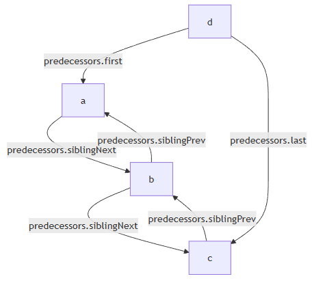

这个图表达了，如果abc都是d的上游的时候，各自的predecessors都会保存什么，没有的就是空引用。

一个`Trace`的`predecessors.first`和`predecessors.last`分别代表了上游所有`Trace`的第一个和最后一个，这些`Trace`的`predecessors.siblingPrev`和`predecessors.siblingNext`则构成了一个链表，把所有的`Trace`串了起来。如果上图中的非法情形不发生，那么一个`Trace`就不会同时是多个上游`Trace`分裂的产物（之可能来源于多个上游，但是每个这样的`Trace`都只有一个下游）。也就是说，如果把每一个**含有多个元素**的`predecessors`视为一个容器，那每一个`Trace`只会出现在一个容器里，也就是只要他自己的`predecessors.siblingPrev`和`predecessors.siblingNext`只要不为空，那么这同时说明了两件事：
- 本`Trace`会跟其他`Trace`合并到唯一的下游
- 本`Trace`的下游的所有上游的`predecessors.siblingPrev`和`predecessors.siblingNext`跟下游`Trace`的`predecessors.first`和`predecessors.last`共同构成了一个完整的双向链表。

说起来有点绕，但实际上就是保证了这么一件事：一个`Trace`只属于一个容器。那么`siblingPrev`和`siblingNext`就是别的唯一的`Trace`的容器的一部分，不会串台。既然不会串台，那确实只需要有一份变量就足够了。

这样做的好处就是省掉了一个新的强类型对象池，而且每个`Trace`的`predecessors`都可能会被下一个`Trace`修改，也就是邻近的一起分配的`Trace`都会互相操作，但是不会操作到更远的，非常的cache friendly。

`successors`同理。

### 第二步：对Trace上的指令做partial execution

每个`Trace`代表了一次状态转移，那么从一个`Trace`自然可以访问到跳转到这里需要执行的所有指令是什么，这可以从他引用的PDA的数据结构上恢复出来。于是我们得先执行一遍，确保知道每一个`BeginObject/ReopenObject/EndObject`操作的对象都是谁。这里可以跳过所有真正的操作，因为我们只追踪对象之间的关系。如果一个对象被`BeginObject`创造出来之后，分裂成了多个分支并被多个`EndObject`操作，这个对象就会记录下来所有的结束点。如果多个`BeginObject`创造出来之后，分支合并到了同一个`EndObject`身上，那Object堆栈里的栈顶就会同时出现这几个对象。也就是说这些对象本身已经包含了歧义的信息。

歧义发生之后我会在指令里面插入一个`ResolveAmbiguity`，里面记录了要把多少个Object堆栈上的对象pop出来，放进一个类型为`XToResolve`的对象的里面之后放回去，那么我就要算出来到底需要pop多少个。然而这么做其实有一个很麻烦的事，就是partial execution跑出来的对象的数目往往需要去重，而且 **“局限性：无法应对复杂的歧义结构”** 这一节的结构最后也会反映到对象的关系里面区，就让整个计算变得非常的复杂，还很容易出错。

现在看来，这个设计算是重写的一个败笔，看到算法这么复杂的时候我就该意识到这个设计是有问题的，可惜年轻的时候人就是比较naive，硬着头皮往下写，还真的把所有的问题都搞定了，用掌控复杂算法和代码的能力掩盖了设计的错误，是不好的。

### 第三步：计算歧义真正发生的起点和终点。

这个步骤旨在识别 **“局限性：无法应对复杂的歧义结构”** 这一节中提到的种种情况，具体的方法略去不谈，但是这一步骤的结果，就是标记了每一个歧义应该从哪一个`Trace`开始和结束，还有具体开始和结束的指令。需要注意的是，对于一个具有多个下游的`Trace`，哪怕歧义从这里开始，起点也可能是每个下游中间的指令。同一个`Trace`也许也有多个指令分别是多个歧义的起点。一个歧义可能有多个分支对应同一个终点。甚至多个歧义所在的`Trace`可能只是一条链表，真正的互相嵌套的分支发生下下游互相嵌套的分支里。反过来也一样。

例子1：同一个歧义，发生了多次分支，在同一个`Trace`结束

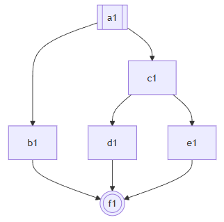

例子2：同一个歧义，在同一个`Trace`开始，中间合并了多次

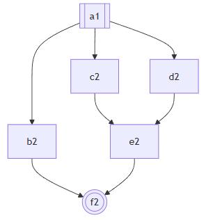

例子3：一个`Trace`的不同的指令引发了两个嵌套的歧义

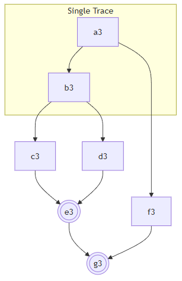

例子4：两个嵌套的歧义，外面的歧义生的分支在里面的歧义的起点之后

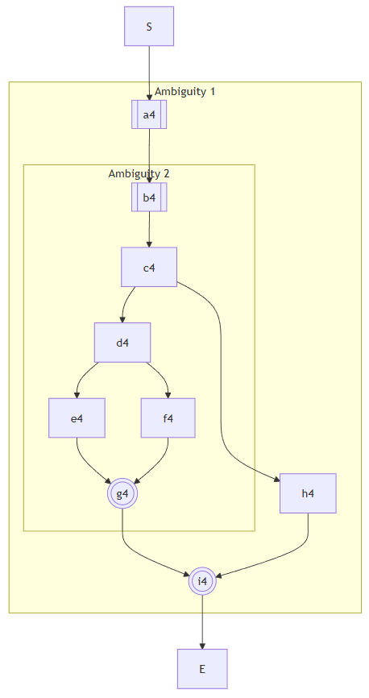

### 第四步：生成ExecutionStep

`ExecutionStep`在构造的过程中是一棵树，构造完了会被重新整理成链表。在表达歧义的过程中，多个`ExceptionStep`组成的结构如下：
- `BEGIN`
- 每一个分支所有指令跑一遍`->...->BRANCH`
- 由`RESOLVE`收尾

就拿上面第一张图来举例子，很明显我们要生成的结构就是`BEGIN`、`->a1->b1->BRANCH`、`->a1->c1->d1->BRANCH`、`->a1->c1->e1->BRANCH`、`->RESOLVE->f1`。由于多个分支都属于同一个歧义，那么`c1`理所当然需要在第二个和第三个分支里分别被执行遍次。

在这里说一下最棘手的一种情况，就是上面的最后一张图。e

首先看`Ambiguity 2`，执行`c4`的时候不能包含`h4`，但是执行`d4`却要把`e4`和`f4`都走一遍。连起来也就是`BEGIN->b4->c4->d4->e4->BRANCH->b4->c4->d4->f4->BRANCH->RESOLVE(2)->g4`。这里的`BEGIN`、`BRANCH`和`RESOLVE`就是分别需要插入指令的地方，比如`RESOLVE`就需要插入`ResolveAmbiguity`好构造AST里面的`XToResolve`类型的对象。而且现实情况中，也有可能`g4`的一半要在两个`BRANCH`前面重复，而`RESOLVE`前面只有`g4`的另一半，在这里就都简化了。

然后看看`Ambiguity 1`，他的路径就是`BEGIN->a4->Ambiguity 2->BRANCH->a4->b4->c4->h4->BRANCH->RESOLVE(2)->i4`。

于是整个`Trace`的`ExecutionStep`链表就是：`S->BEGIN->a4->BEGIN->b4->c4->d4->e4->BRANCH->b4->c4->d4->f4->BRANCH->RESOLVE(2)->g4->BRANCH->a4->b4->c4->h4->BRANCH->RESOLVE(2)->i4->E`。

注意到原本属于`Ambiguity 2`的`b4->c4`竟然在`Ambiguity 1`的另一个分支里出现了。因为`Ambiguity 2`真正的分支是在`d4`发生的，只不过因为前面不断的左递归，导致它生成的AST的第一个`BeginObject`跑到了很前面。

不过说的时候理所当然，实际上要怎么在`Trace`上标记才能让你顺利生成这样的`ExecutionStep`链表呢？一开始也是一个棘手的问题。而且这些情况并不是一下子就摆在我眼前的，一开始只有简单的歧义结构，随着测试的语法越来越复杂，就跟温水煮青蛙一样，每次多一种情况，就在算法上多修改一点，最终变成一堆我自己都看不懂是什么逻辑的代码了。

## 更复杂的reuse/partial rule，还得继续打补丁

这个补丁比较重要，虽然也是为了接受更多的语法，从而去掉了编译错误打上去的，但却是最后的重构的思路的起点。所谓的reuse rule就是前面说到的`!`，而partial rule可以理解为C语言的宏。描述一个稍具规模的语言的语法的时候，不可避免有很多重复的东西，但是却不是很能写成一个单独的语法。因为它虽然到处都用，但是并不想构造出一个独立的AST对象。举个例子，比如[GacUI的Workflow脚本语言](https://vczh-libraries.github.io/doc/current/workflow/lang/module.html)，可以在定义的类型函数变量等等上面加attribute，那这个语法要怎么写呢？有两种思路。

第一种是让`Declaration`右递归，他要么是一个声明，要么是一个attribute加上声明。

```
Declaration
  ::= Attribute:attributes !Declaration
  ::= !ClassDeclaration
  ::= !EnumDeclaration
  ...
  ;
```

第二种是让每一个声明前面都接受一个attribute数组

```
AttributeList
  ::= {Attribute:attributes} as partial WorkflowDeclaration
  ;

Declaration
  ::= AttributeList !ClassDeclaration
  ::= AttributeList !EnumDeclaration
  ...
  ;
```

他们的共同点都是需要在`!`前面就给类成员变量赋值。当然你把`AttributeList`写在每一个具体的声明的语法里面就可以绕过这个问题，但是当时我就想，确实没有理由做出`!`一定要放在最前面的限制。然而这被迫让我加入了一个新指令。为什么呢？让我们来看一下原本我们是怎么处理`!`的。比如说`Declaration ::= !ClassDeclaration`：


然后现在变成了`Declaration ::= AttributeList !ClassDeclaration`，注意因为`AttributeList`是一个partial rule（也就是宏），所以它的内容会被复制到`Declaration`里面变成`Declaration ::= {Attribute:attributes} !ClassDeclaration`：

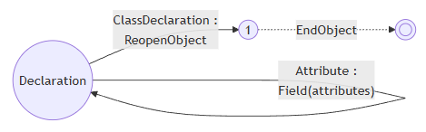

注意到问题了吗？`Attribute`产生的`Field`指令前面没有`BeginObject`，所以`Field`本身到底操作了哪个对象变成了一件没有定义的事情。当然我们都知道他操作的应该是`!`所`ReopenObject`进来的对象，那现在就麻烦了，如何把`Field`指令放到`ReopenObject`前面去操作呢？于是只好加一个placeholder，也就是`DelayFieldAssignment`指令，作为一个标记：

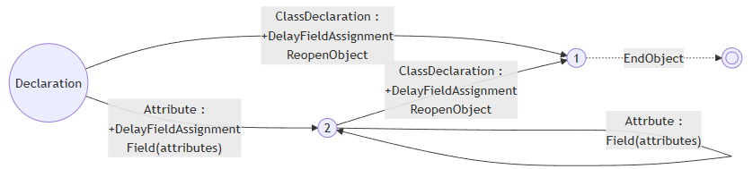

这下糟糕了，`DelayFieldAssignment`的行为要怎么定义呢？并没有办法定义，因为它的出现是为了更改后面的指令的意思，而不是用于操作AST。于是只能硬着头皮先实现出来。实现非常的简单粗暴，就是在`DelayFieldAssignment`遇到`BeginObject`或者`ReopenObject`之前，先开个map把所有的`Field`缓存进去，遇到他们的时候，终于有真正的对象了，一次性把缓存起来的`Field`一股脑执行一遍。

这就非常的难受了。但是因为补丁看起来还是非常的小，而且也没有给其他部分造成什么困难，就跟温水煮青蛙一样，哎呀就先这样吧！殊不知这个设计（当然也包括指令集本身）给合并前缀的优化造成了巨大的困扰，也是我下定决心重新设计的出发点。

## 合并前缀

合并前缀是一个非常重要的性能优化。特别是当你的语法很难表达成LL状态机的时候，总会发生一些几个分支一起parse了一样的东西，好长一段之后终于丢掉所有其他分支留下一个的情况，浪费了海量算力。这种分支往往非常难在语法层面处理，因为他是发生在rule的间接调用上面的。举个简单的例子，我们都知道C++的语句可以用表示开头也可以用类型开头，表达式有自己的一套层数很深的语法，类型也是。然而到了最底下，他们都要尝试一下[qualified identifier](https://en.cppreference.com/w/cpp/language/identifiers.html)，也就是`A::B<C, D, E>::E`这样的表达式。Qualified identifier后面甚至可能是个括号什么的，如果你不知道前面的这一串到底是什么，那就有无限的可能了。直到过了好多年，parser终于看到了类似`{ ... return ... }`的结构，一拍大腿，原来前面是函数声明！到这里扔掉了一大堆分支，留下了最后一个碰巧把它当成函数声明来parse的。这就造成了巨大的算力浪费。

更加难办的是，qualified identifier既可以是表达式也可以是类型，遇到两者都可以出现的地方，比如说模板实参，parser会给我一个歧义的结果（因为一边是表达式的语法构造的，另一边是类型的语法构造的），但是两者其实都是一样的qualified identifier。这就不是一个优化问题，而是错误了。

就算不是C++，哪怕只是[GacUI的Workflow脚本语言](https://vczh-libraries.github.io/doc/current/workflow/lang/module.html)，一个比较长的输入在没有合并前缀优化的时候跑了差不多120k个状态，实现了完整的合并前缀优化之后只需要6k个状态，出来的东西是一样的。可见这个东西非做不可。然而……让我们先来看看合并前缀的三种优化，后面一个都是前面一个更加泛化之后的结果，处理细节各不相同，但是目标是一致的。

首先我们来考虑一下最简单的情况：

```
Rule
  ::= Prefix:prefix ThisRemains as MyObject
  ::= Prefix:prefix ThatRemains as MyObject
  ;
```

两个`Prefix`不仅输入一样，产生的指令也是一样的：

```
+BeginObject(MyObject)
Field(prefix)
```

这样的语法在编译成PDA之后会产生两条从`Rule`起始状态出来的一摸一样的transition，只是通往了不同的地方，我们可以把它合并起来变成一条，两个目标状态也融合成了一个状态。需要注意的是如果有其他状态指向被融合的状态的其中一个的话，那它就不能被删掉。这个过程跟[NFA转DFA](https://en.wikipedia.org/wiki/Powerset_construction)是一样的。

在这里复习一下，带`+`的指令说明它是在transition真正做出动作之前执行的。也就是先有`BeginObject(MyObject)`，再有`Prefix`产生的一系列指令，最后才到`Field(prefix)`。具体的实现就是在`Prefix`被转成指向`Prefix`的状态机的token transition的时候，把所有return transitions的`+`指令单独复制到新的transition上，后面走虚线的时候只执行return transition的非`+`指令。

但这类情况实际上是罕见的，真正常见的是一样的rule input但是指令却不一样的情况。比如说：

```
Rule
  ::= Prefix:prefix Remains1 as MyObject
  ::= Prefix:prefix2 Remains2 as MyObject
  ::= Prefix:prefix Remains3 as YourObject
  ::= Prefix:prefix !Remains4
  ::= !Prefix [left_recursion_inject(X) _Remains5]
  ;
```

这个`left_recursion_inject`会随后解释，这是重写前打的最后一个也是最大的补丁。在上面的语法中，每一行的`Prefix`产生的指令分别是：

```
+BeginObject(MyObject)
... Prefix ...
Field(prefix)
```

```
+BeginObject(MyObject)
... Prefix ...
Field(prefix2)
```

```
+BeginObject(YourObject)
... Prefix ...
Field(prefix)
```

```
+DelayFieldAssignment
... Prefix ...
Field(prefix)
```

```
... Prefix ...
LriStore
+DelayFieldAssignment
...
LriFetch
```

这下麻烦了，指令不一样怎么办呢？有些情况还能通过把非`+`指令挪给后面的transition当`+`指令绕过去，有些则可以从：

```
BeginObject(MyObject)
  Prefix ...
  Field(prefix)
```

改成

```
Prefix ...
LriStore
BeginObject(MyObject)
  LriFecth
  Field(prefix)
```

`LriStore`和`LriFetch`可以理解为把Object堆栈栈顶pop出来存到一个寄存器里，后面再从寄存器读出来push回Object堆栈。这也是引入`left_recursion_inject`的时候新加的，会随后解释。总之通过总总办法先把指令对齐，然后才能合并。

## 为什么总是一直打补丁

做到这已经非常累了，正常来说早就要审视一下过去的设计是不是有问题了。不过实际情况是，从文章的开头走到这已经花了10年，这个项目一开始很简单，就是GacUI当初需要JSON和XML的时候，觉得以后反正还有很多parser要写，不如干脆做个GLR parser gen。后面随着feature的加入越来越复杂，每隔一两年就做一点修改，完全忘记了上一次打补丁的情绪和感受。而且前面每一个补丁规模都很小，有些甚至只需要修改语法的编译器而不需要改动到PDA的设计，就算是改动了也只不过是小修小补，自己经常意识不到自己在打补丁，令人麻痹大意，温水煮青蛙也。一路走过来，我们破坏了很多原本引入的抽象，每一个补丁都逐渐依赖抽象背后的实现，实际上就是在实践[依赖巧合编程](https://en.wikipedia.org/wiki/Programming_by_permutation)。没有在需要重构的时候马上动手，就会有越来越多的代码依赖错误的设计，总有一天会改不动。这个时候要么你真的特别牛逼把重构做出来，要么重写，要么就[干脆放弃](https://en.wikipedia.org/wiki/The_Mythical_Man-Month)。

不过换个角度，如今的资本主义社会令码农并不能在法律上产生对代码的ownership，其实你写的都是别人的东西，到底要不要容忍[错误的实践](https://en.wikipedia.org/wiki/List_of_software_anti-patterns)，其实也见仁见智了。不过是否执行好的实践，最好只是你的一个选择，而不是受限于你的能力。所以下班后折腾自己的项目，亲自体验这些东西，我认为都是很有必要的。特别是LLM时代AI把屎一车一车的运到屎山上喷，如果你不具备这种能力，项目可能在你可以离职前就已经光速崩掉了，那这就不好办了。就算你上班用不上AI，下班后用AI喷屎然后自己铲干净，也是一种练习。

## 最后的超级大补丁：left_recursion_inject和!prefix_merge

于是我们终于迎来了最后的一个补丁。这个补丁的规模之大，解决的问题之复杂，终于让我意识到我需要修改设计了。不过彼时还对原本的设计抱有侥幸心理，想看看是不是还能继续做下去。最后确实做出来了，但是我也忍不了了。这个补丁原本是尝试做C++ parser的时候引入的，解决的是上面提到的问题：

- 一个C++语句既可以从类型开始也可以从表达式开始，但是她们都可以有一个共同的前缀，就是复杂的qualified identifier。直接parse会浪费海量算力。
- 一个模板参数既可以是类型也可以是表达式，但是他们也同时都是复杂的qualified identifier。直接parse会导致产生两个一摸一样的歧义结果。

第一个情况还可以说性能问题不能解决就放着，第二个就是bug了，直接导致语法写不出来。我们还不能为了模板参数直接分化出只有qualified identifier的这种情况，因为qualified identifier本身也可以是类型和表达式的前缀，我们很难再做出一个类型和表达式的语法，让他们既可以从qualified identifier开始，本身又不包含只有qualified identifier的这种情况。既然问题要解决，又不能修改语法，想在状态机身上入手难度也很大，那只能加新功能了。毕竟有bug就一定要修是不是。

Ladies and gentlemen！让我们来看看最后的超级大补丁是怎么打的。

### Qualified Identifier问题的简化版本

我们可以来看一个简化后的例子，加入我们要parse的就是类型或者表达式的结构，表达式可以是a\*b，类型可以是a\*，当然a本身都满足两边的要求。由于语法是强类型的，怎么设计AST就很重要。一般有两种做法，要么就是设计类似`IdentifierExpr`和`IdentifierType`这样的结构，要么就是让`Expr`和`Type`都继承自`TypeOrExpr`，然后让`Identifier`变成`TypeOrExpr`的直接子类，而`Expr`和`Type`表达不可能互相造成歧义的其他类型。

对于C++模板参数来说，我们当然要选择后者。因为在resolve符号之前我们根本不知道那是类型还是表达式，如果建模成`IdentifierExpr`和`IdentifierType`就不得不构造两遍`Identifier`然后把它分别包在这两个类型里面了，没有解决浪费算力的问题。也就是说，如果输入是一个`Identifier`，那么我们的语法应该只返回一个结果：

```
Id
  :: NAME:name as Identifier
  ;

PrimitiveExpr
  ::= !Id
  ::= NUMBER:content as NumberExpr
  ;

Expr
  ::= !PrimitiveExpr
  ::= Expr:left "*" PrimitiveExpr:right as MulExpr
  ;

PrimitiveType
  ::= !Id
  ::= "int" as IntType
  ;

Type
  ::= !PrimitiveType
  ::= Type:type "*" as PointerType
  ;

@parser Module
  ::= !Expr
  ::= !Type
  ;
```

这样看是不是就清楚了？`a*1`会走

```
Module
::= Expr
::= Expr "*" PrimitiveExpr
::= PrimitiveExpr "*" PrimitiveExpr
::= Id "*" PrimitiveExpr
::= NAME "*" NUMBER
```

而`a*`会走

```
Module
::= Type
::= Type "*"
::= PrimitiveType "*"
::= Id "*"
::= NAME "*"
```

但是`a`就会同时走

```
Module
::= Expr
::= PrimitiveExpr
::= Id
::= NAME
```

和

```
Module
::= Type
::= PrimitiveType
::= Id
::= NAME
```

这就是我们要解决的问题：虽然有两个path，但是我们只要一个`Identifier`，而不是parser告诉我们有歧义，结果给了两个一样的`Identifier`。

### left_recursion_inject

我的第一个想法是让写语法的人自己标记出来，说`Module`的几条分支都可以走到`Id`，那我们就应该先试试看`Id`。如果成功了，那就有三个选择：
- 返回。反正`Id`本来就是`Module`的其中一种情况，语义上是正确的。
- 假装是走进了`Expr`分支，从`PrimitiveExpr ::= !Id`的尾巴开始继续做。
- 假装是走进了`Type`分支，从`PrimitiveType ::= !Id`的尾巴开始继续做。

“假装”这件事是很容易做的，因为在PDA上的transition本来就有return transitions的数据，一开始是在合并出最大的PDA的时候用的。最大的PDA只有token input，那我们如何表达一个状态是走了多少rule之后才来到这的呢？就是把全面所有的transition都装进return transitions里面。实际执行的时候return transitions就会被压栈，最后在双圆圈那个地方一个一个退出来。在这也是一个道理，假装从`Module`直接走进`PrimitiveExpr ::= !Id`就是生成一条虚线transition，其return transitions就依次排列着：

```
PrimitiveExpr ::= @ Id -> PrimitiveExpr ::= Id @
Expr ::= @ PrimitiveExpr -> Expr ::= PrimitiveExpr @
Module ::= @ Expr -> Module ::= Expr @
```

后续从epsilon-NFA生成NFA的时候就会和后面的transition合并之后直接指向`PrimitiveExpr`的双圆圈。上面提到的`LriStore`和`LriFetch`指令便是在这里用上的。因为这一次跳转把那么多transition合并在了一起，他们会有不可预测的一系列`+`指令。为了顺利吧`Id`产生的对象在执行完一系列`+`指令之后正好保留在Object堆栈的栈顶，于是就创造了一个寄存器。

具体的实现怎么做呢？既然是让写语法的人来标记，那必然就要发明新的语法。我们需要表达的就有两件事：
- 先parse `Id`。
- parse完跳转到哪里。

很明显这就是两个语法。首先我用`left_recursion_placeholder`表达了“parse完跳转到哪里”的问题。我们注意从`Module`到`Id`的一系列动作，必定是以`!Id`结束的，所以`left_recursion_placeholder`本身就必须是一个完整的语法，放在所有`!Id`存在的地方，也就是`PrimitiveExpr`和`PrimitiveType`

```
PrimitiveExpr
  ::= left_recursion_placeholder(IdShortcut)
  ::= !Id
  ::= NUMBER:content as NumberExpr
  ;


PrimitiveType
  ::= left_recursion_placeholder(IdShortcut)
  ::= !Id
  ::= "int" as IntType
  ;
```

接着就要来表达“先parse Id”。这其实蕴涵着两个动作，首先是“parse Id”，其次是parse之后的跳转。尽管上面已经标记了`left_recursion_placeholder`，但我们仍然需要算出return transitions的部分，也就意味着原来的`Module`语法是要保留的，作用就是计算出跳转到每一个placeholder到底需要什么return transitions。这就意味着`Module`要写两遍，一个是真的语法，另一个是魔改后的入口。别人调用`Module`的时候就得用这个入口，而这个入口依赖原本的`Module`来做剩下的计算：

```
Module_Original
  ::= !Expr
  ::= !Type
  ;

@parser Module
  ::= !Id [left_recursion_inject(IdShortcut) Module_Original]
  ;
```

语法设计出来了，吭哧吭哧实现了，做了海量测试，然后就开始投入实战。然而一个问题马上就浮现了出来。这个例子是简单，但是实际上C++有太多地方都需要这种结构了，就连表达式本身都可能是`Type{}`，需要写的`left_recursion_placeholder`、`left_recursion_inject`和`_Original`都太多太多了。而且这里面还有一些其他情况，也就是`Module`一路走到`!Id`但是中间并不是全都是`!Rule`的形式，这就是为什么`left_recursion_inject`的例子会带一个`[]`，你可以不写，那么`left_recursion_inject`就从本来可选变成现在强制的了，自然前面的`!Id`就不会直接当成`Module`的一种情况直接返回了。

后面还出现一些更复杂的情况，也就是这种`Id`并不只有一层，如果类型和表达式都共享了`Id`，但是`Id`本身又是一种`Module`，怎么办呢？这种时候我们就要允许`left_recursion_inject(IdShortcut) Module_Original`还可以继续嵌套`left_recursion_inject`的结构。

哇塞没完没了了，本来语法已经很复杂了，现在为了解决歧义和性能的问题改到断手。这可不行！

### !prefix_merge

显然让写语法的人自己标记还是太难了，但是`left_recursion_inject`作为一个语法结构他是有用的，因为它至少指导了PDA的生成。就像前面的开关是个宏一样，我也可以为它发明一个宏，这就是`!prefix_merge`。我们只要标记出来`left_recursion_placeholder`是因为`Id`引起的，至于剩下的`left_recursion_inject`和`_Original`让编译器自己去算就好了。所以在彻底重做之前的最后一个方案长这样：

```
Id
  :: NAME:name as Identifier
  ;

PrimitiveExpr
  ::= !prefix_merge(Id)
  ::= NUMBER:content as NumberExpr
  ;

Expr
  ::= !PrimitiveExpr
  ::= Expr:left "*" PrimitiveExpr:right as MulExpr
  ;

PrimitiveType
  ::= !prefix_merge(Id)
  ::= "int" as IntType
  ;

Type
  ::= !PrimitiveType
  ::= Type:type "*" as PointerType
  ;

@parser Module
  ::= !Expr
  ::= !Type
  ;
```

编译器一看，`Module`开始能走到好几个重复的`!prefix_merge(Id)`，于是开始搜集语法的结构，然后把他改写成上面`left_recursion_inject`的样子，再生成PDA就行了。

于是测试程序里的C++语法就从[用!prefix_merge](https://github.com/vczh-libraries/VlppParser2/tree/release-2.0-archive-DfaBoEo/Test/Source/BuiltIn-Cpp/Syntax/Syntax)被重写成了[用left_recursion_inject](https://github.com/vczh-libraries/VlppParser2/blob/release-2.0-archive-DfaBoEo/Test/ParserLog/ParserGen/SyntaxRewrittenActual%5BBuiltIn-Cpp%5D.txt)了，感受一下这个宏的必要性。

## 补丁终于还是打不下去了

为什么会有上面的终极大补丁？本质上还是因为指令设计的不好。我们要合并前缀，就不得不处理前缀的transition们的指令。然而这里的指令其实包含了后面的语法的其他信息，最明显的莫过于`BeginObject`里面的类型名了，或者干脆不存在`BeginObject`，而且我前缀没parse完我怎么知道你要走哪个分支，不知道的话那些`Field`指令要怎么办呢？正是因为需要合并的前缀其实并不一样，总有太多细节上的区别，所以才把合并前缀的方法整的这么累，更别说后面的`!prefix_merge`。从“合并前缀”这一节占了开头到这里超过1/3的篇幅就知道实际上做起来有多累。

更别说`!prefix_merge`做了这么多事情，其实解决的问题仍然不完整。最明显的一个问题，就只有前缀需要合并吗？如果`left_recursion_inject`是从语法中间开始的怎么办？到此已经山穷水尽走投无路了。

所以为了彻底重做“合并前缀”这一节描述的全部内容，不得不从指令的设计入手，重新设计一套新的，目标就是让所有语法的前缀，如果他们都一样，那就得产生相同的指令。而且所有的“合并前缀”操作必须可以从任意一个PDA的状态出发，才能对语法做完整的优化。

接下来我们将详细描述新的指令集的灵感来源、实际的设计以及它是如何解决上面提到的全部困难的。此时已经是2025年的年底，距离`VlppParser`项目的开始已经过去了13年。甚至这个repo都不是新的。

学生时代的我用Win32 API封装UI库的时候就留下了一些基础代码。后来演变成了架构上跨平台的GacUI，而Windows的部分仍然保留了最开始的基础代码。然而此时的GacUI仍然是一个编译器项目的附属工具。一开始只是想着把C#写的编辑器用C++再写一遍，手上有没有趁手的UI库，那就自己来做一个吧！结果一不小心做泛化了，就有了他自己的repo。codeplex死了之后又转到了github上，随着代码越来越大最后被[切成了一堆repo](https://github.com/vczh-libraries)。

我们都说monorepo好，但是一个人做就不太行，为了让项目的每个部分可以独立进化，我甚至开发了一个预处理程序，用来吧一个repo的所有C++代码合并成几个大文件（甚至就只有一对h/cpp）。这个github org的CI是一个巨大的powershell脚本，他会做所有以来更新的动作，然后编译运行测试程序，repo里面有些C++代码还是用其他repo的工具生成出来的（典型的就是各种parser）

脚本用到的所有工具一开始还是C#写的，后来用C++重新做了一次，配置文件是个XML，XML的parse自然就是`VlppParser`随后变成`VlppParser2`生成的。可见`VlppParser2`早就变成了整个org运作的基础。现在在一些"Deprecated"文件夹里面，还能看到很多因为C++本身的进步而废弃掉的代码生成工具，典型的就有[variadic template argument](https://en.cppreference.com/w/cpp/language/parameter_pack.html)发明出来之前我做的一个更灵活的预处理程序。以前Func啊Tuple什么的就是用他写的，现在这些东西当然早就用C++重做了。

## 新的指令：StackBegin指令集

“合并前缀”一章详细解释了优化PDA和解决歧义的时候发生的种种困难，大多数都是围绕着如何处理指令集的。如果要重新设计，那新的指令及就必须满足以下特征：
- 前缀一样的两条语法指令集的前缀也一样（也就是说不能出现AST类型和Field）。
- 在`!`之前的指令前缀不要包含后面有`!`的信息。
- 第一个rule input不要区分是否左递归（为了解决更早之前提到的复杂的歧义结构）

这里可以做一些简单的推理：
- 如果在执行到指向双圆圈的虚线transition之前不暴露AST类型和Field，那就只能把它们放在后面。然而由于`[]`和`(|)`这样的选择结构的存在，那种把rule input入栈后被Field出栈的做法自然就不能用了，因为分支的左右两边可能入栈了完全不同的类型和成员变量的名字。这直接说明了我们不能使用栈，那下一个备选自然就是打表了。我们可以用rule input在语法中出现的位置作为key，只在结尾处把所有的key和成员变量绑定起来就行了。这甚至直接解决了第一条的问题，不同的语法如果他的前缀长得一样，那么生成的key必然也是一样的，他们最终生成不同的类型绑定不同的成员变量那都是后面的事了。
- 如果`!`不影响第一个rule input生成的指令，那就意味着我们永远要生成`BeginObject`，然后才在后面解决`!`的`ReopenObject`怎么生效的问题。由于上一条的关系，`BeginObject`已经不带类型了，那么`DelayFieldAssignment`也就顺理成章地上位了。有没有注意到第一条讲的其实就是任何时候都要首先生成`DelayFieldAssignment`？
- 左递归的指令结构必须让第一个rule input在原本的`BeginObject`之前结束，如果我们不做区分，那就意味着任何第一个rule input产生的指令都必须以这种结构出现。

不过Create堆栈和Object堆栈依然需要留下来。因为`EndObject`后挂起正在编辑的对象的需求依然存在。一通推理可能还是比较乱，让我们从一个例子入手。假如我们要生成`1+2`这个语法树，原本的指令大概长这样（假设没有左递归）：

```
BeginObject(AddExpr)
  ... 1 ...
  Field(left)
  ... 2 ...
  Field(right)
EndObject
```

首先我们得把前面的Field都换成key，只在最后才把key和Field联系起来：

```
BeginObject(AddExpr)
  ... 1 ...
  StackSlot(0)
  ... 2 ...
  StackSlot(2)
  Field(left, 0)
  Field(right, 2)
EndObject
```

其次，我们“任何时候都要首先生成`DelayFieldAssignment`”：

```
DelayFieldAssignment
  ... 1 ...
  StackSlot(0)
  ... 2 ...
  StackSlot(2)
  BeginObject(AddExpr)
  Field(left, 0)
  Field(right, 2)
EndObject
```

最后，我们不能区分是否左递归，所以任何与发的第一个rule input都得拿到外面：

```
... 1 ...
DelayFieldAssignment
  StackSlot(0)
  ... 2 ...
  StackSlot(2)
  BeginObject(AddExpr)
  Field(left, 0)
  Field(right, 2)
EndObject
```

新的指令当然要有新的名字，一边是他们原本的意思在这么多年的补丁中已经悄然发生了变化，另一边是改名有利于C++全面找出所有需要重构的地方，使用海量编译错误代替海量测试错误，搞不好还有什么地方没被测试覆盖。所以改名总是最好的：

```
... 1 ...
StackBegin
  StackSlot(0)
  ... 2 ...
  StackSlot(2)
  CreateObject(AddExpr)
  Field(left, 0)
  Field(right, 2)
StackEnd
```

这样我们不妨把新的指令集称之为“StackBegin指令”。于是我们就可以重新推演每个指令的意思：
- StackBegin：在Create堆栈栈顶上构造一个新的scope
- StackSlot：把Object栈顶pop出来存进当前scope的表格里，跟一个key对应起来
- CreateObject/Field/StackEnd：从当前scope拿出保存的所有对象，把他们当成员变量的值，构造出对应的AST类型的实例，Create栈顶的当前scope扔掉，构造完的对象push进Object堆栈。这一堆会在后面细化。

这样左递归也不需要特别处理，因为`... 1 ...`肯定以`StackEnd`结束，东西一定在Object堆栈栈顶，`StackBegin`不对Object堆栈做任何干涉，`StackSlot`就一定能读到。这种做法还有一个美妙的特性，让我们来看`1*2+3`，现在我们知道，不管语法是不是左递归的，出来地指令都一样：

```
... 1 ...
StackBegin
  StackSlot(0)
  ... 2 ...
  StackSlot(2)
  CreateObject(MulExpr)
  Field(left, 0)
  Field(right, 2)
StackEnd
StackBegin
  StackSlot(0)
  ... 3 ...
  StackSlot(2)
  CreateObject(AddExpr)
  Field(left, 0)
  Field(right, 2)
StackEnd
```

本来嵌套的结构直接展开了！还记得为什么`left_recursion_inject`需要引入`LriStore`和`LriFetch`吗？由于新的指令结构的发生，生成的指令不仅是左递归无关，同时也自动地`left_recursion_inject`无关了。这给我们的优化算法打开了一扇新的大门：可能`!prefix_merge`不需要手动标记了，我们完全可以自动找出来，不仅如此，它再也不需要是一个single reuse rule了（也就是语法只有一个rule input，它还带有`!`）。这也就是说，前缀合并可以发生在任何PDA状态处，连前缀这个约束也消失了。

而且既然`StackBegin`不再是语法的第一个指令，那`+`指令的存在也就没有必要了。`StackBegin`是生在第一个rule input之前还是之后都没有区别，而且我们总是会把它移动到后面，也就是说指令再也不需要区分是否带`+`了。在这里复习一下，带`+`的指令说明它是在transition真正做出动作之前执行的。

我们来回顾一下“四则运算与左递归”一节中的例子，当时我们从这样的语法：

```
Term
  ::= !Factor
  :：= Term:left "*" Factor:right as MulExpr
  ;
```

生成了这样的PDA：


新的版本就变成了：

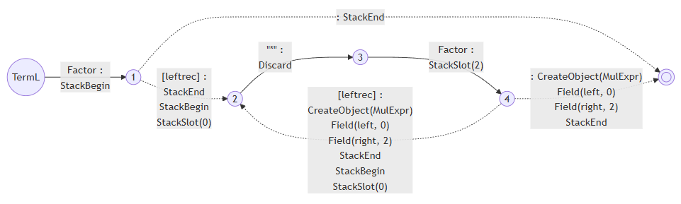

我们注意到带`!`的语法依然会生成`StackBegin`和`StackEnd`，但是没有`CreateObject`。虽然这个例子是简单的，但是更复杂的例子我们会在`!`的前后都绑定成员变量。那没有`CreateObject`的话，`Field`指令要对谁发生呢？显然作用的对象就是Object栈顶的对象。因为现在不存在`DelayFieldAssignment`原本要解决的“在`!`之前对成员变量赋值的问题，我们就可以把`CreateObject`、`Field`和`StackEnd`具体做了什么细化下来了：
- `CreateObject`：根据指定的AST类型创建一个实例，push进Object堆栈。
- `Field`：作用在栈顶对象。
- `StackEnd`：把当前的scope从Create栈顶拿掉。

由于所有的成员变量都已经从Object栈顶拿掉存进当前scope的表格里面了，所以这里不会发生冲突。

### 更多的例子

在“合并前缀”一节中，我们曾经举了一些例子：

```
Rule
  ::= Prefix:prefix Remains1 as MyObject
  ::= Prefix:prefix2 Remains2 as MyObject
  ::= Prefix:prefix Remains3 as YourObject
  ::= Prefix:prefix !Remains4
  ::= !Prefix [left_recursion_inject(X) _Remains5]
  ;
```

在原本的BeginObject指令集的框架下，每一行的`Prefix`分别会产生左边指令前缀，而StackBegin指令集则在右边：

```
+BeginObject(MyObject)         ... Prefix ...
... Prefix ...                 StackBegin
Field(prefix)                  StackSlot(0)
```

```
+BeginObject(MyObject)         ... Prefix ...
... Prefix ...                 StackBegin
Field(prefix2)                 StackSlot(0)
```

```
+BeginObject(YourObject)       ... Prefix ...
... Prefix ...                 StackBegin
Field(prefix)                  StackSlot(0)
```

```
+DelayFieldAssignment          ... Prefix ...
... Prefix ...                 StackBegin
Field(prefix)                  StackSlot(0)
```

```
... Prefix ...                 ... Prefix ...
LriStore                       StackBegin
+DelayFieldAssignment          StackSlot(0)
...
LriFetch
```


唯一有区别的是`Rule:field`和`!Rule`，他们一个会产生`StackSlot`一个没有，所以处理这种情况的代码依然存在，然而复杂程度已经断崖式下跌。

在这里必须指出，由于新指令集的出现解锁了新算法，原本的`left_recursion_inject`和`!prefix_merge`已经不存在了。写语法的人再也不需要意识到他写的语法有这种情况从而需要手动标记，这一切全都自动发生了。

## 新的!prefix_merge

我们来回顾一下前面的例子：

```
Id
  :: NAME:name as Identifier
  ;

PrimitiveExpr
  ::= !Id
  ::= NUMBER:content as NumberExpr
  ;

Expr
  ::= !PrimitiveExpr
  ::= Expr:left "*" PrimitiveExpr:right as MulExpr
  ;

PrimitiveType
  ::= !Id
  ::= "int" as IntType
  ;

Type
  ::= !PrimitiveType
  ::= Type:type "*" as PointerType
  ;

@parser Module
  ::= !Expr
  ::= !Type
  ;
```

既然不需要手动标记`left_recursion_inject`和`!prefix_merge`，就等于我们要从这个语法里面，看出来`Module`可以从两条路去到`Id`。这个问题有一个简单暴力的方法，就是我们先按照start set给所有的rule排序。所谓start set就是构成某个rule的第一个rule的集合，比如说`Expr`的start set就是`PrimitiveExpr`和`Id`。当然也有rule的token start set，但是在这里略过不谈，处理方法是一样的。

前面提到过我们不支持间接左递归，那排除掉一个rule左递归自己的情况，把start set视为一个关系的话那么rule就构成一个偏序集合。对它们进行排序的其中一个简单算法就是[Kosaraju-Sharir算法](https://en.wikipedia.org/wiki/Kosaraju%27s_algorithm#:~:text=In%20computer%20science%2C%20Kosaraju%2DSharir's,Rao%20Kosaraju%20and%20Micha%20Sharir.)。我们甚至可以用这个算法同时找到所有间接左递归的情况然后当场报错。

排序完就可以很暴力的处理这件事了。一个rule的start set可以表达成一个bit set，那么我们从`Module`开始，分别对`Expr`和`Type`按顺序测试一下他们的start set是否包含某个rule。形如C++那样的语言无非也就两千个rule，做两千次布尔运算快如闪电，根本不用管算法复杂度。稍微优化一下你还可以直接算出两个start set的交集，然后再按偏序顺序去遍历里面的bit，不过这对运行效率几乎没有实质性的提升，所以我目前还是选择了最暴力的方法，以后真的会被卡在这里再说（我觉得这辈子都不太可能）。等我们算出来`Expr`和`Type`都可以从`Id`开始之后，就可以把`Id`当`!prefix_merge`去处理了。

不过此时我们再也不是通过重写语法去做，而是直接在PDA上面做。虽然实际的算法需要考虑很多边界条件，但是思路是很简单的：把start set本身也看成一个偏序图，我们的目标就是找到尽可能高层尽可能少的`Expr`和`Type`的start set的交集的元素，并覆盖各自的start set的所有叶子节点。等交集的元素都找完了所有的叶子节点还没被全部覆盖，那剩下的就是各自剩下的情况了。每找到一个解我们都可以在start set里面把解的间接父节点全部去掉，是否覆盖所有叶子结点的问题就转换成了这个集合是否变成空集的问题。而按照前面提到的排序结果逐个测试的话，我们一定可以先测试到父节点。这一切都大大简化了处理的过程。

我们来模拟一下具体的运算过程，上面的例子的情况比较简单，在C++语法里面可以找到更复杂的情况。首先我们得到`Expr`和`Type`的start set，并表达成偏序图。在这里这个偏序图正好是一棵树，非常好画：

```
Expr
  |
  +--PrimitiveExpr
       |
       +--Id
       |   |
       |   +--NAME
       |
       +--NUMBER

Type
  |
  +--PrimitiveType
       |
       +--Id
       |   |
       |   +--NAME
       |
       +--"int"
```

把每个rule的start set都看成关系的话，所有rule排序的其中一个结果（偏序关系排序的结果是不唯一的）就是：

```
Module, Expr, PrimitiveExpr, Type, PrimitiveType, Id
```

挨个看下去就可以知道，`Expr`和`Type`的start set的交集里，按照上面的顺序第一个出现的rule就是`Id`。因此我们得到了一个`!prefix_merge`的解`Id`。这个时候就可以把start set里面`Id`、`Id`自己的start set、和`Expr`和`Type`的start set里`Id`的父节点都拿掉，剩下：

```
Expr
  |
  +--NUMBER

Type
  |
  +--"int"
```

此时start set交集已经是空了。剩下的依样画葫芦，一直做到两个start set都是空集，我们就可以知道，`Id`应该标记上`!prefix_merge`，而且`Expr`和`Type`都分别有`NUMBER`和`"int"`的情况要处理。因此`Module`的PDA的开始状态出去的所有transition就会被改成`Id`、`NUMBER`和`"int"`这三个。

现在我们的新指令已经在绝大多数情况下都保持前缀的指令相同了（见“更多的例子”一节），那我们就可以把`Module`的PDA改成，先parse一个`Id`，然后可选地左递归到`Module->Expr->PrimitiveExpr->Id`和`Module->Type->PrimitiveType->Id`的末尾。当然`Module`也可以不从`Id`开始，所以一旦要做这种合并，就得把整个start set都处理一遍。这个“左递归到”是什么意思呢？可以参考“一个可以被执行的PDA”一节，就是通过操纵return transitions的方式让parser以为他是真的通过这么多层transition一层一层进去的。

比起`!prefix_merge`的方法，这个新算法的优势是可以从PDA的任何状态开始，不局限于rule的前缀了。而且我们再也不需要给`Module`留一个重写语法前的备份了，因为只要把合并前缀前的transition留下来就可以了，等于把`Module`和`Module_Original`做在了一个PDA里面。

## StackBegin指令集下在Trace上计算歧义的新方法

在“VlppParser2诞生！”一节中我们介绍了VlppParser2处理歧义的方法。当初也是走了一些弯路，而且这个部分打补丁的后果是最严重的，直接导致了整个算法的重新实现。不过这里更多的是实现的问题。

在“第二步：对Trace上的指令做partial execution”这一节中，提到了对parse好的Trace做partial execution的具体做法。当时遇到的问题就是判断`ResolveAmbiguity`的时候要从Object堆栈弹出多少对象，但是同时执行分支产生的对象记录错综复杂，这一步做起来特别难。然而StackBegin指令集从根本上消灭了这个问题，因为`ResolveAmbiguity`的目标被存在了一个固定编号的slot里面（也就是-2）。既然如此，也就可以实现一个更简化的办法：就是不在追踪具体的对象，改而追踪`StackBegin`和`StackEnd`之间的多对多关系。

现在存进Create堆栈和Object堆栈的再也不是代表某个具体AST对象的记录，而是`StackBegin`的记录。每一个`StackBegin`会创造一个记录。每次`StackSlot`发生的时候，两个`StackBegin`记录就会被联系起来，这是一个field的关系。`!`本身也会创造一个记录，也就是这两个`StackBegin`其实是属于同一个具体的AST对象的，这是一个reuse的关系。维护这两套关系的目标，就是要确定任意一个AST对象是由哪些`StackBegin`开始又由哪些`StackEnd`结束。

StackBegin指令集的设计，会让对象的第一个rule，不管它属于field关系还是reuse关系，它的`StackBegin`和`StackEnd`整个范围都是发生在所属节点的前面的，所以一个AST对象最开始的节点，当然不仅仅由最后一个关闭它的`StackEnd`所属的`StackBegin`决定，要把这个对象的field关系和reuse关系的所有`StackBegin`都考虑进去，取最早出现的那个。而且由于reuse关系串连起来的所有记录的成员变量实际上都是同一个AST对象的成员变量，所以就有“reuse的field也是field”的规则。考虑了这一切之后，计算一个AST对象最早的`StackBegin`们和最晚的`StackEnd`们也就变得非常简单。

还是看看四则运算的例子：

```
Term
  ::= !Factor
  :：= Term:left "*" Factor:right as MulExpr
  ;
```

如果我们从`Term`走了`!Factor`，他们分别都会产生`StackBegin`和`StackEnd`，因此就有两个记录。而`Factor`产生的记录就是`Term`产生的记录的reuse。

如果我们走了第二行，`Term:left`的整个`StackBegin`和`StackEnd`会在`Term`的前面产生。虽然前者是后者的field，但是前者的指令并没有被包裹在后者的指令里面。

那么对于形如`1*2+3`这样的AST，`1*2`本身会走`Expr ::= !Term`，然后`Term`会走一次左递归之后再走一次`Term ::= !Factor`。虽然这个表达式只产生了5个AST对象，但是却有几十个`StackBegin`和`StackEnd`，可见每个AST对象对应了好些`StackBegin`记录，这就是为什么分别确定AST对象真实的`StackBegin`和`StackEnd`非常的重要，因为它们往往不是配对的。

实现它有一个技巧，就是我们可以把所有`StackBegin`创造的记录按照时间关系用一个链表串起来，按顺序遍历它们的同时优先访问field和reuse关系指向的记录，访问到了就在记录里设置一个flag。我们需要一个额外的堆栈来实现“优先访问field和reuse关系”，但是为了让这个堆栈不要退化成特别长，前面提到的链表就非常有用。所有的记录访问几遍就可以把每一个AST对象最早和最晚的`StackBegin`们和`StackEnd`们分别找到了。

## StackBegin指令集下生成ExecutionStep的新方法

在“第四步：生成ExecutionStep”一节中我们介绍了ExceptionStep的定义，这里并没有真的“新方法”，只不过是过去的算法实现的实在太扭曲了，于是整个删掉做了一遍。上面的第三部已经确定了每个歧义的范围，于是这是一个简单的递归算法：把歧义的每一个分支拉直，然后几个分支重新拼接在一起，就等于把歧义本身拉直了。现在让我们复习一下之前的例子：


我们先来看歧义`b4..g4`。我们从`b4`开始，遇到不同的分支就开枝散叶（注意这里的`c4`到`h4`的分支是属于`a4`的，所以不走）。合并起来的部分也不要管，出来一棵树：

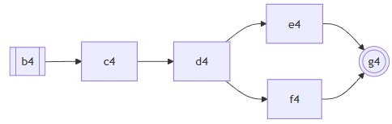

然后从`b4`到所有`g4`的分叉，共享的部分都直接复制一遍，加上`BEGIN`、`BRANCH`和`RESOLVE`节点：

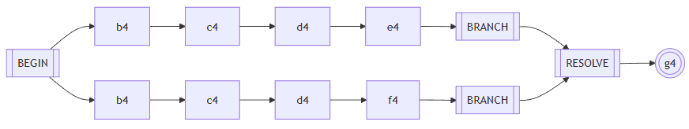

最后头尾相接:

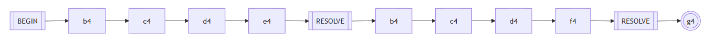

接下来就可以对`a4..i4`如法炮制：

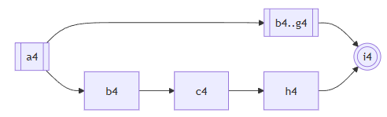

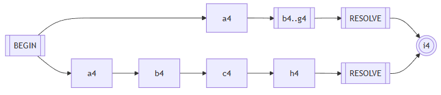

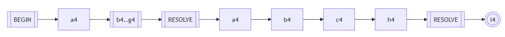

现在我们已经得到了`a4..i4`的`ExecutionStep`，只要把剩下的头尾接上去，这个算法就跑完了

## VlppParser2如何自举

把上面的所有内容总结一下，使用VlppParser2从撰写语法到parse出东西来一共要经历这么多事：

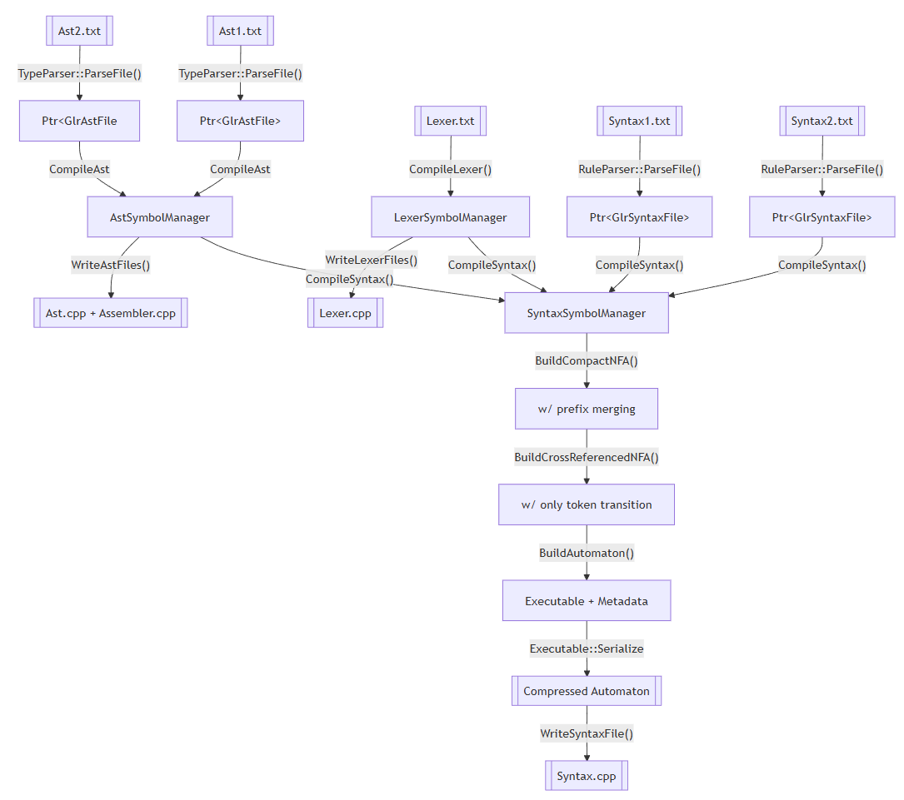

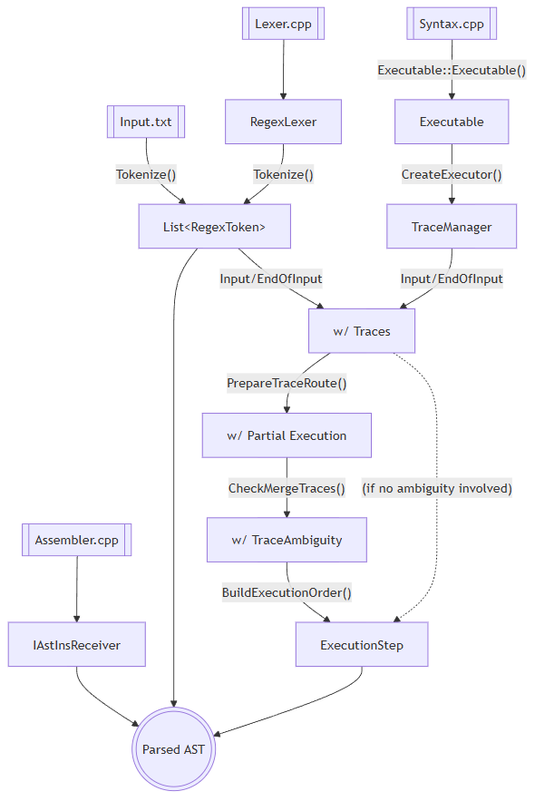

## 尾声

<!--
copilot翻译成英语
- 改正错别字，改正语法错误，最低限度地调整语序
- 原文复制到en_us.md
- 抽出所有标题和段落，生成task list，写进en_us_todo.md
- 一边翻译一边标记todo一边生成词汇表vocabulary.md
- 翻译的结果保存金en_us_translation.md，标题重写，翻译的时候一段中文注释一段英语
- 结束后重新复制回en_us.md
- git对比一下翻译是否完整
-->
