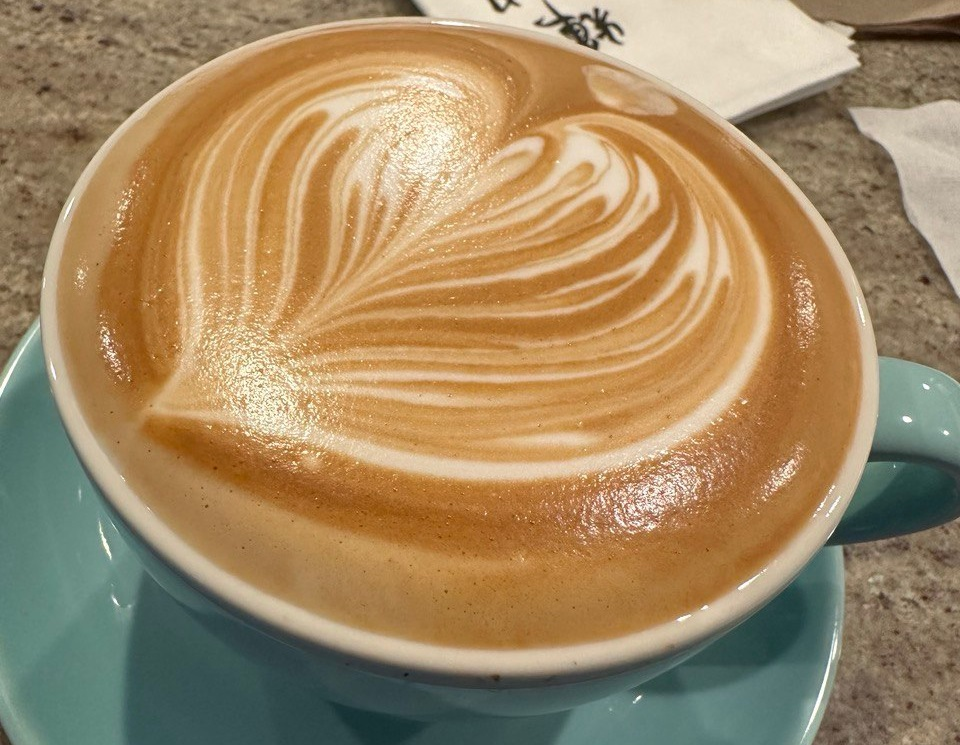

# Breville and Coffee Beans

## To do

- Intelligentsia House
- Kahawa Safari Blend
- Blue Bottle Bold
- Kona Coffee Blend Medium Roast
- TraderJoes Organic FairTrade Shade Grown Ethiopian Medium Dark Roast
- TraderJoes Organic FairTrade Five Country Blend Dark Roast

## Yes!

| Single Shot | Double Shot | Brand |
|--|--|--|
|| 3/20.8g+ | Intelligentsia Black Cat Expresso |
| 3/10.7g | 4/21.3g+ | Stumptown Hair Bender |
|| 5/20.5g- | Ladro Fremont Medium Roast **FRESH** |
|| 5/18.0g | Fonte Uptown Espresso **FRESH** |

## hmmm

| Single Shot | Double Shot | Brand |
|--|--|--|
| 3/10.6g || Blue Bottle Espresso |
| 4/9.8g- | 5/18.7g- | Zoka Tuscan |
|| 5/18.5g+ 6/20.0g? | Zoka Tatoosh |

## No!

| Single Shot | Double Shot | Brand |
|--|--|--|
| 2/10.5g | 3/20.5g | Madcap Bolt (Deep Chocolate Syrupy) |
|| 4/20.5g- | Campfire Summer Camp Medium Dark Roast |

## Note

- Knodos basket could be 2.5g more than breville 54mm, needs precise experiment.

## Milk Frothing (Breville 876)

- 奶倒进16oz奶缸到240ml/8oz
- 橡胶拉环拉向自己抬高到最高，杯嘴顶住橡胶（为了一致性）
- 迅速调整到喷嘴出现强力气流后开始读秒
- 咔哒声8个一组（约5秒），数10组以上，取决于液面升高的情况
  - 薄打：保持奶缸角度不变，延长时间则只能稍微加厚
  - 厚打：让喷气口一直处于不断升高的液面表面，延长时间显著加厚
    - Horizon 倒缸厚打10组
    - Alexandre 倒缸厚打9组有点厚
- 如果有20oz大奶缸打后换缸，可以打得更厚
- 然后放斜开始旋转，数10组以上，取决于杯壁温度
- 开机后第一杯总是过薄，可能是温度问题

## Latte Art

- 咖啡的脂肪末很重要，粗泡会随着时间迅速消失
- 需要测量咖啡液重量，2 shots 通常在35-45g左右
- 融合要干净，不能太多，融合速度不能过快
  - 融合足够干净的前提下，融合的太少会导致花纹边缘模糊
- 奶泡厚度是次要的，但是不能太薄，太厚可以倒缸
  - 认准牛奶脂肪含量至少8g/240ml
  - 打发时间需要观察液面高度，跟脂肪含量不成单调关系

### Demo

