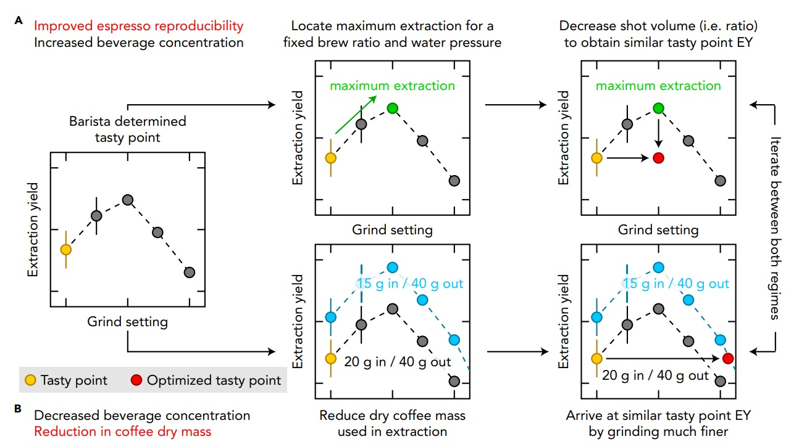

# Espresso 调参进阶

在[上一篇文章](./GettingStarted)发布之后已经两个月了，在这个过程中我发现了之前很多认识不够正确，我也学习了[一些咖啡萃取相关的资料](https://www.cell.com/matter/fulltext/S2590-2385%2819%2930410-2)，并加以实践，得到了很多体会。文章中一些图片将从这篇论文中复制，我觉得对制作 espresso 作用非常大。

## 参数的稳定性

好的设备确实很重要，之前就一直提到 dial in 一个很重要的前提就是萃取咖啡的参数要稳定。但是我发现一个不可避免的不稳定参数来源于 Breville 自己的磨豆机。Breville 磨豆机其实很不精确，而且无论如何都没办法通过技巧来克服，于是我购买了 Niche Duo。其次是水量的问题，Breville 876 的温度可控的范围很窄，压力甚至是不可以修改的，所以我不怎么关心这个内容。但是水量确实是可以控制的，我在阅读说明书的时候发现可以通过长按`2 CUP`键来进入手动模式。为了配合这个模式我购买了 timemore nano，这个称非常灵敏，我很满意，比 Breville 自己带的那个不知道高到哪里去了。最后是 precise basket，我使用了 IMS nanotech，不过他具体比 Breville 自带的 basket 好在哪里，这个体会不是很深刻。也许 Breville 自带的 basket 其实也还可以，也许是 IMS nanotech 不够厉害。

除此之外，上一篇文章中提到的稳定咖啡机温度的技巧仍然是有用的。以前不知道为什么，只是在实践中发现的，但是后来经过更多的学习，我发现其实是因为 Breville 876 的冲煮头和蒸汽棒共用一个 pump 导致的。虽然机器有有 PID，但效果其实不是很好，如果你打了奶紧接着很快就做下一次萃取，水温是会有一点偏差的。而且如果你隔了一段时间时间不萃取的话，冲煮头也会冷却（虽然人感觉可能不明显）。再加上 basket 的冷却也会影响萃取，所以这里重新强调一下我的对策：

- 在磨粉之前把空的 basket 挂上去，用你的杯子接 2 shots 的水，然后这么放着，等到磨粉结束之后拿下来装填。
- 磨豆的时候多给两三颗，喷点水后再磨，磨完了把超出的部分舍去即可。Niche Duo 虽然号称 zero retention，但实际上显然是做不到的，咖啡机里面一直都留有不少粉，导致磨粉有时候多给一点有时候少给一点。不过这个 single dose 的设计实在是太有用了。理论上调节磨豆参数之后需要先浪费几克，很多人都这么说，但是实践下来我发现感觉效果不是很明显。不过换豆的时候我会这么做。
- 长按`2 CUP`之后，听到 pump 的声音开始计时，pre-infusion的时机可以读秒，然后根据水流的速度在萃取到需要的水量前提前结束。这一步纯粹靠人操作，会有一点误差，不过经过练习可以把误差控制在半克左右，影响不是很大。
- 每次萃取结束之后要记下磨豆机的刻度、实际装填的粉量、使用的时间、萃取的咖啡液重量、饮用感受等。

Niche Duo 真的做的好，转盘改一点效果就变一点，随机性比 Breville 自己的磨豆机实在低太多了。

## 开始调参

每次使用新豆总要从一个参数开始调参，第一个参数其实不是很重要。粉可以从 20g 开始，磨豆机随便给一个差不多的参数即可，控制咖啡液的重量是粉的两倍，然后开始计时。如果萃取后 basket 有明显的水分漂浮在上面，或者整个粉饼是软的，说明粉太少了，跟你的冲煮头和 basket 不匹配。萃取结束之后冲煮头部分的压力会卸掉，如果你的粉饼太薄的话，就会爆开，拿出来之后就很难看了，虽然说这不一定代表萃取的结果不好，但是清洗很麻烦也是不好的。

然后先通过修改磨豆机的参数把时间控制在 25s-30s 左右。时间太短就磨豆机转盘的刻度调小，时间太长就调大，要注意这个时间我是包含了 pre-infusion 的。Pre-infusion 我自己是给了八秒，比较贴近 Breville 自己的预设参数。我现在还不是很明白修改 pre-infusion 的时间会带来什么效果，反正就先这么用着吧。

到了这一步，就可以开始喝了。一般来讲这个时候多半都是不太好喝的，但是至少是一个还过得去的起点。

## 修改参数

有两个因素决定了一杯 espresso 的味道，分别是萃取的量和比例。溶解到咖啡液里面的物质变多，味道就会变重，反之就会变淡。而随着萃取比例的增大，espresso 里面会依次感受到明显的酸味、甜味、油脂以及苦味。漂浮在 espresso 上方的泡沫是由油脂和二氧化碳构成的。对于新鲜的豆（一般指的是烘焙半个月内），二氧化碳的量都是很足的，那么你萃取出来的泡沫如果很少，说明这个萃取比例比较低，味道可能就会比较酸。泡沫本身会带有香气，还有额外的苦味，所以太少的话会闻不到明显的气味，太多的话可能会让你觉得不好喝。所以为了让萃取出来的 espresso 变好喝，首先自己要具备准确感受味道的能力。对于没怎么喝过咖啡的人，酸味和苦味可能会难以分辨。这个只要喝多了自然就没问题了。

那现在让我们来看看，改变磨豆机的设置、使用的粉量和萃取的咖啡液重量，分别会带来什么效果：

### 磨豆机的设置

(to be continued)

### 粉量

(to be continued)

### 咖啡液重量

(to be continued)

### Channeling

(to be continued)

### 论文提供的优化路径

虽然这篇论文的目标是为了降低大量生产咖啡的成本，不过最后他提到的一些优化路径确实比较有意思，不过对我们在家里一天只弄几杯 espresso 起到的帮助不是很大，但是也可以读一读。

(to be continued)

## 尾声

(to be continued)
